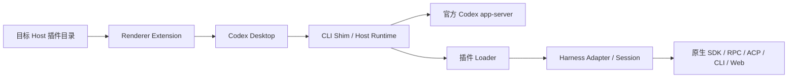

<div align="center">

# CodexHost

**在 Codex Desktop 中运行 Pi 和其他 Harness**

我们认为 **Codex Desktop** 提供了目前最好的桌面开发交互体验。

但 **Codex** 并不是唯一优秀的 **Agent Harness**，也有人偏好 **Claude Code** 和 **Pi Agent**。

**CodexHost** 让你在 **Codex Desktop** 中选择真正执行任务的 **Agent**，同时保留 **Codex** 的原生体验，并让它们协作完成任务

⭐ 如果这个项目对你有帮助，请给我们一个 Star！⭐

<p>
  <a href="https://opensource.org/licenses/MIT"></a>
  <a href="https://linux.do"></a>
</p>

<p>
  <a href="https://pi.dev/"></a>
  <a href="https://openai.com/codex/"></a>
  <a href="https://code.claude.com/docs/en/quickstart"></a>
  <a href="https://opencode.ai/docs/"></a>
  <a href="https://github.com/deepseek-ai/deepseek-harness"></a>
  <a href="https://grok.com/"></a>
  <a href="https://github.com/can1357/oh-my-pi"></a>
  <a href="https://antigravity.google/product/antigravity-cli"></a>
  <a href="https://kiro.dev/docs/cli/"></a>
  <a href="https://www.codebuddy.cn/home/"></a>
  <a href="https://cursor.com/docs/cli/overview"></a>
</p>

<p align="center">
  <sub>简体中文 · <a href="docs/README.en.md">English</a> · <a href="docs/README.ko.md">한국어</a></sub>
</p>
</div>

<p align="center">
  <strong>快速导航：</strong>
  <a href="#界面预览">界面预览</a> •
  <a href="#快速使用">快速使用</a> •
  <a href="#功能状态">功能状态</a> •
  <a href="#跨-agent-协作">跨 Agent 协作</a> •
  <a href="#远程连接-harness">远程连接</a> •
  <a href="#加入交流群">加入交流群</a> •
  <a href="#开发">开发</a>
</p>


## 界面预览

无需切换应用，**Pi、Claude Code、OpenCode、OMP、Grok Build 和 DeepSeek Harness** 都可以在同一个 Codex Desktop 窗口中直接使用。

https://github.com/user-attachments/assets/c48192d7-23ff-4f6e-b61a-6345a655bb76

### 界面

<div align="center">
  
</div>

## 快速使用

**使用 npm**

> 支持 macOS、Windows 和 [x64/ARM64 Linux](docs/linux.zh-CN.md)。

```bash
npm install -g @codexhost/cli
codexhost
```

**或下载** [安装包](https://github.com/BytePioneer-AI/codex-host/releases)（macOS、Windows）

<details>
<summary>安装问题排查</summary>

**macOS** - Apple 验证问题

首次打开时如提示应用无法验证，请执行：

```bash
xattr -dr com.apple.quarantine /Applications/codexhost.app
```

**Windows** - 绿色解压版 Codex Desktop

如使用绿色版本，将 `CODEXHOST_INSTALL_ROOT` 设置为 Codex Desktop 的解压目录：

```powershell
[Environment]::SetEnvironmentVariable("CODEXHOST_INSTALL_ROOT", "D:\CodexPortable", "User")
```

然后完全退出 Codex Desktop，重新打开终端并启动 codexhost。

</details>

### 外观设置

在 `设置 → 外观` 中可以开启 **换行显示思考文本**，让思考块中的长行自动换行。该选项默认关闭，选择保存在本机并立即生效，普通 Shell 输出不受影响。

### 更新检查与 GitHub 限流

codexhost 优先通过已登录的 [GitHub CLI](https://cli.github.com/)（`gh auth login --hostname github.com`）检查最新 Release，使用账户的 API 额度，减少共享代理出口的匿名限流影响。凭证由 `gh` 管理，codexhost 不读取或保存 Token。

未安装、未登录或调用失败时会回退到公开 API；单次 `gh` 调用最多等待 5 秒。支持 PATH、macOS Homebrew 和常见 Windows/Linux 安装位置；也可通过 Host 环境变量 `CODEXHOST_GH_COMMAND` 指定可执行文件路径（不带参数）。安装包下载和校验流程保持不变；认证请求仍受 GitHub 账户及次级限流约束。

### 交互展示

<table>
  <tr>
    <td colspan="2" valign="top">
      <p><strong>完整工作界面</strong></p>
      <div align="center">
        
      </div>
    </td>
  </tr>
  <tr>
    <td width="50%" valign="top">
      <p><strong>Agent、账号与 Model 选择</strong></p>
      <div align="center">
        
      </div>
    </td>
    <td width="50%" valign="top">
      <p><strong>Usage 与费用信息</strong></p>
      
    </td>
  </tr>
  <tr>
    <td colspan="2" valign="top">
      <p><strong>多账号与额度管理</strong></p>
      <div align="center">
        
      </div>
    </td>
  </tr>
  <tr>
    <td colspan="2" valign="top">
      
      <p>macOS 会在原生 ChatGPT 菜单栏图标内追加剩余额度百分比，Windows 则使用任务栏覆盖图标；优先使用 5 小时窗口，没有时回退到 7 天窗口。</p>
    </td>
  </tr>
  <tr>
    <td colspan="2" valign="top">
      <p><strong>Mermaid 图表可视化渲染</strong></p>
      <div align="center">
        
      </div>
    </td>
  </tr>
</table>

## 功能状态

官方 Codex 保留原生 app-server 路径。当前源码的[预装发行清单](scripts/release/harness-plugins.json)包含以下十个外部 Harness；插件、原生 CLI 和登录态分别管理，安装 codexhost 不会代为安装或登录各 Harness。

下表是接入方式与能力边界，不是全部版本的实机认证。Model、Thinking、权限和交互以目标 Host 当前的 inspection / Session 能力为准；流式回复、工具状态、Diff 和 Usage 由各 Adapter 按原生数据投影，不存在的数据不会伪造。

| Harness | 原生接口 | Fork / 修订上一条 | 主要边界 |
| --- | --- | --- | --- |
| Pi | JSONL RPC | 支持，含跨目录 Fork | 无等价 Permission Mode；支持本地原生会话导入 |
| Oh My Pi（OMP） | JSONL RPC | 支持，含跨目录 Fork | 子代理观察以当前 transport 的订阅探测为准 |
| Claude Code | Agent SDK | 支持，同目录 | 执行读取原生项目规则；macOS 受管远程经 Aqua Broker |
| OpenCode | SDK / Server / SSE | 支持，同目录 | 配置以原生回读为准；取消请求失败不改写真实 Turn 终态 |
| Grok | ACP + 原生扩展 | 支持，含跨目录 Fork | 原生插话、Plan；权限在创建时设置，回退派生新 Session |
| DeepSeek Harness | 托管 Web / journal | 支持，同目录 | 精确支持 `0.1.2-rc.1` / `0.1.5-rc.1`；支持本地原生会话导入 |
| Antigravity CLI | stream-json / Hook / 原生历史 | 支持，含跨目录 Fork | 仅 Skip permissions；派生时校验已有原生历史与资源 |
| Kiro CLI | ACP agent engine v3 | 支持，含跨目录 Fork | 未知权限值明确拒绝；原生子代理可观察，不提供过程正文读取 |
| CodeBuddy | ACP | 不支持 | 配置与交互走原生协议，不由 Host 模拟历史派生 |
| Cursor CLI | ACP + 原生历史 | 不支持 | 推理强度通过原生模型变体选择；无人值守映射原生 `--force` |
| Command Code | CLI 打印模式 NDJSON + 原生转录 | 不支持 | 每 Turn 一个 `-p` 进程；权限档仅 Skip / Read-only / Plan，见[接入说明](docs/command-code-harness-integration.md) |

**Antigravity：**仅提供 **Skip permissions（危险）**，使用原生 `--dangerously-skip-permissions`；codexhost 不添加工具审批或工作区访问限制。提问与子代理是独立能力，详见[权限说明](docs/antigravity-tool-approval.md)和[子代理说明](docs/antigravity-subagents.md)。

**运行中调整方向：**有原生 steering 的 Session 使用原生插话；其余受支持路径使用取消、等待旧轮终态、再开始新轮。二者语义不同，见[外部 Thread 调整方向](docs/external-thread-steering.md)。固定模型或空 Model Catalog 的可用 Harness 也可以提交，不会因为没有可选模型而落到 Codex。

## 跨 Agent 协作

**空闲资源：**Host 通过统一生命周期合同，在支持安全挂起的 Harness 空闲 60 秒后释放原生资源，保留 Thread 并按需恢复。活动任务和未知后台工作不会被强制回收；支持范围与资源释放、任务静默的区别见[资源生命周期](docs/harness-resource-lifecycle.md)。

你可以让当前 Agent 把独立任务交给另一个 Harness。例如：

> 让 `claude-code` 独立审查这次修改，并指出兼容性风险。
>
> 让 `pi` 调查这个测试为什么偶发失败。
>
> 让 `omp` 实现这个功能，我继续整理文档。
>
> 让 `opencode` 在独立 Thread 中验证这个修复，并运行相关测试。

CodexHost 会为目标 Harness 创建独立的 Native Session。委派会话将出现在 Codex Desktop 的会话列表中，你可以随时打开、查看进度或继续对话。

需要持续观察多个任务时，`thread observe` 在程序内部续等并过滤普通进度，只在完成、失败、需要输入或到达复查时间等事件发生时返回。[观察器用法与外层等待限制](docs/thread-observer.md)。

<details>
<summary><h3 id="远程连接-harness">远程连接 Harness</h3></summary>


在本机的 Codex Desktop 中使用远程节点上的 Harness，在远程机器执行任务，同时继续使用 Codex Desktop 的统一界面。两端需要安装相同版本的 codexhost。

**支持两种连接方式：**

#### 1️⃣ SSH 远程（推荐用于 Mac/Linux 服务器）

通过 SSH 连接并控制其他开发节点上的 Harness，需要 Codex Desktop 原生 SSH 工作区。

| 客户端 ↓ / 远程 Host → | macOS | Linux | Windows |
| --- | --- | --- | --- |
| macOS | ✅ | ✅ | ❌ |
| Linux | ✅ | ✅ | ❌ |
| Windows | ✅ | ✅ | ❌ |

在 SSH 远程主机上执行：

```bash
npm install -g @codexhost/cli
codexhost remote install
codexhost remote start
codexhost remote status
```

然后通过本地 codexhost 启动 Codex Desktop，打开 SSH 工作区，在远程输入框的 Agent/Model 选择器中选择目标 Harness。

[查看 SSH 配置、诊断与卸载文档 →](docs/remote-ssh-host.zh-CN.md)

#### 2️⃣ Remote Control 远程（实验 · 推荐用于 Windows）

Windows 作为被控 Host 时，可以保留 Codex Desktop 官方配对、账号认证和 relay，在另一台已配对电脑的 Codex Desktop 中使用 Windows 上的 Harness。需先确保官方 Remote Control 已经可以运行原生 Codex 任务。

这条链路不新增公网服务或 TCP 端口；Harness 凭据仍保留在被控 Windows 上。

[查看 Remote Control 配置、传输边界与诊断文档 →](docs/remote-control-host.zh-CN.md)

</details>

<details>
<summary><h3>怎么做的</h3></summary>

codexhost 按 Harness 的原生接口接入：Claude Code 使用 SDK，Pi / OMP 使用 RPC，Grok / Kiro / CodeBuddy / Cursor 使用 ACP，DeepSeek 使用托管 Web，Antigravity 使用 CLI / Hook，Command Code 使用 CLI 打印模式。

- **Desktop**：保留官方外壳，以 CDP / Electron Inspector 和 Renderer Extension 增强选择与展示。
- **Host**：CLI Shim 转发官方 Codex 请求；外部 Thread 通过公共协议投影、操作占位、持久化和恢复流程处理。
- **插件**：目标 Host 动态加载已启用插件，Manifest 提供名称、图标和安装链接，Adapter / Session 提供真实能力与状态。
- **原生执行**：原生历史、权限确认、取消和资源清理由对应 Adapter 负责，Host 不模拟原生不支持的能力。

完整边界和源码入口见[当前架构](docs/harness-plugin-architecture.md)。

</details>

## 加入交流群

<table align="center">
  <tr>
    <td>
      <strong>加入交流群</strong><br />
      <sub>对 CodexHost 用法、功能感兴趣的开发者可以扫码加入微信群交流。</sub>
      <ul>
        <li><sub>安装问题可以加群询问</sub></li>
        <li><sub>功能建议与反馈</sub></li>
        <li><sub>开发问题讨论</sub></li>
        <li><sub>Bug 问题建议提交 <strong>issue</strong></sub></li>
      </ul>
      <sub><strong>欢迎一起贡献~ </strong></sub>
    </td>
    <td align="center">
      
    </td>
  </tr>
</table>

## 开发

提交 Issue 或 PR 前可阅读[贡献说明](CONTRIBUTING.md)；PR 标题标签、简短 CI 结果和发布前校验见[仓库维护自动化](docs/repository-maintenance.md)。

环境要求：官方 Codex Desktop、Node.js 22.x（≥22.19）或 24.x、Rust。

```bash
git clone https://github.com/BytePioneer-AI/codex-host
cd codex-host
npm ci
npm start
```

### 运行架构



公共合同、Host 编排、原生协议和 Native 平台职责分别维护。详见[架构说明](docs/harness-plugin-architecture.md)、[插件运行时与信任边界](docs/harness-plugin-runtime.md)及[文档目录](docs/index.md)。

### 新增 Harness

实现插件 Manifest、工厂、Adapter、Session 和对应原生通信；在用户插件目录中显式启用并重启 Host。符合公共合同的新 ID 可由目标 Host 目录直接进入 Picker、配置草稿与 Sidebar，无需为名字或图标增加 Renderer 分支。预装到发行版是单独步骤，由发行清单管理。

动态目录不代表全部原生能力自动可用。应声明能力与范围，处理环境隔离、取消、历史与关闭，并接入[公共一致性验证](docs/adapter-conformance.md)。仓库内 [codexhost-add-harness Skill](.agents/skills/codexhost-add-harness/SKILL.md)提供实现入口和接入要求。

### 验证

从 [package.json](package.json)选择与改动相符的检查；以下命令不会主动启动 Desktop：

```bash
npm run typecheck
npm run lint
npm run test:typescript -- --maxWorkers=2
npm run test:rust
npm run test:e2e -- --workers=2
```

`test:typescript` 包含 TypeScript 与预装插件构建；E2E 使用合成浏览器页面，需本机已有可用浏览器。按范围选取定向测试即可，不要求每次修改运行所有命令。`npm start` 才是源码构建并启动的入口，macOS / Windows 会先停止现有 Codex Desktop；`npm start -- --no-build` 复用已有产物。

[2026-09-12 整改记录](docs/full-project-review-2026-09-12/remediation/README.md)保存当时的 3,771 项 TypeScript、172 项 Rust 和 73 项浏览器回归结果。它是固定代码快照的证据，不是本次文档修改重新运行的测试，也不代表真实 Harness、Desktop 或部署已验收。

## 鸣谢

- 感谢 [LINUX DO](https://linux.do/) 社区一直以来的支持。
- 感谢 [Paseo](https://github.com/getpaseo/paseo) 项目在多 Harness 接入思路与架构设计方面带来的启发与参考。
