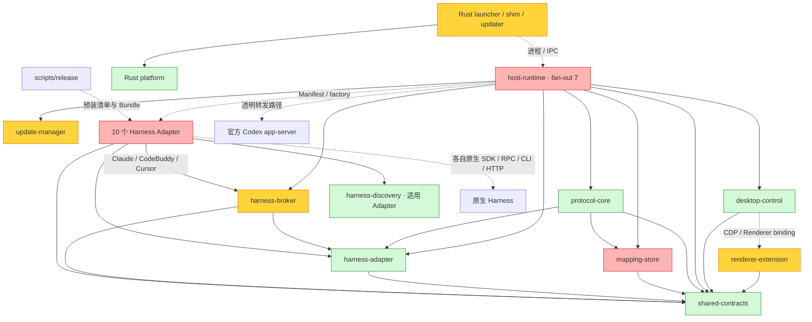

# codexhost 全项目 Code Review 报告

**审查日期：2026-09-12　｜　分支：local/all-fixes　｜　HEAD：38964658185bd090b4044f0cc9f5b575d8284b87**

**结论：现有 Host/Adapter 分层可以继续演进，但当前基线不宜被视为已经完成统一、可靠的多 Harness 产品接入。** 主要阻碍是原生语义与 Host 状态交接不完整，而不是缺少一个通用基类：项目规则可能未加载，历史派生可能假成功，异常/重启后状态可能分裂，能力声明与 UI/真实协议之间仍有落差。

本轮综合保留 **29 项可操作 findings：7 项 P1、21 项 P2、1 项 P3**，另列 **7 项架构演进建议**。优先处理 Claude 项目配置、Grok/Antigravity 历史一致性、Kiro 无效权限、Host 输出异常收口、委派崩溃恢复，以及 Linux 更新目录错位。P1 表示应优先修复的规则/数据/核心流程问题，不表示已经在生产造成损失；P2 是有明确条件的功能或可靠性缺陷，P3 是较低影响的状态一致性问题。

8 个 Sol high 只读子代理分工审查，主代理逐项追踪重要调用链、校正严重度、排除误报并整合。采用 brooks-audit / brooks-review 的架构与维护性视角、codexhost-add-harness 的原生对接合同、codex-dynamic-workflows 的分工核验；历史检索仅用于定位线索，结论由当前源码或本轮结果支撑。

**证据边界：** 全仓目录/包依赖盘点，关键链路深入审查，辅助工具抽样；不是逐行形式证明。盘点覆盖21个TS workspace package、10个Adapter和4个产品Rust crate；packages/crates 的 src 共403文件、129,347物理行，包含注释和Rust内嵌测试。没有启动真实Harness/模型、Desktop、远程Host，也没有安装、更新、部署、提交或推送。

**实际检查：** 生产TS与插件构建通过；独立边界检查通过；34个聚焦TS测试文件共763 passed、1 Windows专属 skipped；Rust定向12 passed。`npm run typecheck` 失败15处测试类型错误，`npm run lint` 失败2处Grok规则错误。另有5个隔离复现，见 [验证与原始日志](/Users/luo/Documents/github/codex-host/docs/full-project-review-2026-09-12/evidence/validation.md) 和 [隔离复现记录](/Users/luo/Documents/github/codex-host/docs/full-project-review-2026-09-12/evidence/reproductions.md)。这些通过结果不替代真实原生/目标平台验收。

审查开始时只有既存未跟踪目录 docs/codexhost-grok-delegation-20260910/；未改动或据其声明提升本次证据等级。最终新增内容仅为本报告与证据文件，源码保持原样。

## Module Dependency Graph

实线表示代码/包依赖，虚线表示运行时加载或进程协议。只画主干，Adapter 的 Broker 特例在后文说明。颜色表示本轮发现集中程度，不是量化健康评分。

依赖盘点有 21 个 TypeScript workspace package，其中 10 个 Adapter；生产 package dependencies 图未发现环。Host fan-out=7 是组合根的合理特征，不能单凭该数字判为架构错误。shared-contracts 无 workspace 反向依赖，Renderer 仅直接依赖 shared-contracts；本轮独立边界检查通过。Rust 4 个产品 crate 另有 Gate 工具 crate。图不把 RPC 关系误画成浏览器对 Node 包的编译依赖。

值得保留的是 **Host 负责 Thread/协议/持久化，Adapter 负责原生能力和资源** 的分工。动态 Loader、opaque Native Ref/Turn Ref/Checkpoint、统一事件模型以及显式不支持能力已经建立可用骨架。当前主要矛盾发生在跨层事实交接：原生已执行与 Host 已提交、请求取消与实际终结、目录发现与 UI 可用、Session 能力与名称分支、单测模拟与真实原生协议。

大型模块是这些交接集中的线索：[packages/host-runtime/src/app-server-host.ts:1](/Users/luo/Documents/github/codex-host/packages/host-runtime/src/app-server-host.ts:1) 为 4,726 行，DeepSeek modern/session 2,950 行、Claude Adapter 2,893 行、renderer-binding-probe 2,877 行。建议沿原生 admission、Turn 生命周期、配置提交、历史替换和 UI 路由职责拆分；行数本身不计作 finding。

## Findings

| 编号 | 优先级 | 问题 |
|---|---|---|
| F01 | P1 | [Claude 执行时跳过项目规则与 project/local settings](#f01) |
| F02 | P1 | [Grok 回退先原地截断历史，后续失败不能恢复源](#f02) |
| F03 | P1 | [Antigravity 派生历史可能只有 sidecar 正确，原生副本失败仍报成功](#f03) |
| F04 | P1 | [Kiro 未知 Permission Mode 被静默映射为 autopilot](#f04) |
| F05 | P1 | [输出消费异常缺少终结处理，会留下永远 busy 的 Thread](#f05) |
| F06 | P1 | [创建中断后残留的委派去重记录指向已删除 Thread](#f06) |
| F25 | P1 | [Linux npm 自更新的 TS/Rust 状态目录不一致](#f25) |
| F07 | P2 | [配置成功响应不保证持久化，Model 路径甚至没有更新 carrier](#f07) |
| F08 | P2 | [无人值守委派的执行意图没有跨重启保存](#f08) |
| F09 | P2 | [OMP 恢复/派生的首个进程丢失逐 Thread 环境](#f09) |
| F10 | P2 | [OpenCode 取消请求失败后污染真实 Turn 终态](#f10) |
| F11 | P2 | [OpenCode 权限更新成功但回读不匹配时仍保留旧公开状态](#f11) |
| F12 | P2 | [Grok 在父 Turn 结束后丢弃后台 Subagent 更新](#f12) |
| F13 | P2 | [native steering 的产品声明硬编码 Grok，与实际 Session 能力分裂](#f13) |
| F14 | P2 | [原生 Codex endpoint 不支持扩展 RPC 时，官方 steer 被截断](#f14) |
| F15 | P2 | [Pi/OMP/OpenCode fault 后结束输出但未自动清理原生资源](#f15) |
| F16 | P2 | [Kiro 取消通知未送达也返回已受理](#f16) |
| F17 | P2 | [Kiro Adapter.close 后仍可创建新 transport](#f17) |
| F18 | P2 | [二次异步派发绕过 Thread 队列，command 与回退/删除可交错](#f18) |
| F19 | P2 | [外部 turn/start 静默过滤掉混合输入中的图像](#f19) |
| F20 | P2 | [多个 Runtime 的委派列表截断后无法翻页](#f20) |
| F22 | P2 | [OMP 18.1.18 默认关闭子代理转发，Adapter 未订阅却声明可观测](#f22) |
| F23 | P2 | [Usage 通知永久绑定首个 client，切换 Host 后不重订阅](#f23) |
| F24 | P2 | [DeepSeek Modern 共享 Web 不接收逐 Session 环境，递归委派身份无法隔离](#f24) |
| F26 | P2 | [Unix Shim 将信号退出压成普通 exit 1](#f26) |
| F27 | P2 | [remote uninstall 不停止运行中的 managed listener](#f27) |
| F28 | P2 | [更新下载缺少应用级期限与取消通道，可长期占有更新锁](#f28) |
| F29 | P2 | [macOS Broker 升级失败后无法恢复上一运行 generation](#f29) |
| F21 | P3 | [快速完成的外部委派首次响应仍硬编码 running](#f21) |

### F01 · P1 · Claude 执行时跳过项目规则与 project/local settings

**位置：** [packages/adapters/claude-code/src/sdk-transport.ts:460](/Users/luo/Documents/github/codex-host/packages/adapters/claude-code/src/sdk-transport.ts:460)；[node_modules/@anthropic-ai/claude-agent-sdk/sdk.d.ts:1900](/Users/luo/Documents/github/codex-host/node_modules/@anthropic-ai/claude-agent-sdk/sdk.d.ts:1900)

**触发与后果：** 仓库依赖 CLAUDE.md、.claude/settings.json 或 .claude/settings.local.json，通过 codexhost 创建 Claude Session。 真实 Query 和 Inspector 均限定 settingSources 为 user。当前锁定 SDK 0.3.220 明确要求包含 project 才加载 CLAUDE.md；项目/local 配置也被排除。项目指令、权限与 Hook 的执行语义因此偏离原生 CLI。具体某项 deny 在选定权限模式中的效果仍需原生测试，不能据此声称所有安全规则均被绕过。

**修复与验证：** 让执行 Query 采用原生预期的完整 setting sources；Inspector 如有只读隔离需求可以单独说明。用隔离 cwd 验证项目指令、project deny、local 覆盖，避免测试继续只断言错误参数。

**证据与限制：** 源码与本地锁定 SDK 声明交叉确认；本轮未启动真实 Claude。

### F02 · P1 · Grok 回退先原地截断历史，后续失败不能恢复源

**位置：** [packages/adapters/grok/src/grok-rewind.ts:156](/Users/luo/Documents/github/codex-host/packages/adapters/grok/src/grok-rewind.ts:156)；[packages/adapters/grok/src/grok-adapter.ts:1820](/Users/luo/Documents/github/codex-host/packages/adapters/grok/src/grok-adapter.ts:1820)；[packages/host-runtime/src/external-thread-rollback.ts:166](/Users/luo/Documents/github/codex-host/packages/host-runtime/src/external-thread-rollback.ts:166)

**触发与后果：** 原生 rewind 已完成，但随后的配置恢复、快照校验、映射 CAS 或文件写入失败。 rollbackLastTurn 对 source nativeSessionId 执行原地 rewind，并要求返回相同 identity。Host 提交之前源历史已减少；后续错误路径只关闭新 wrapper，没有补偿。因此调用方看到回退失败时，原生最后一轮可能已经丢失，而 Host 映射仍保留它。Host 有 running 检查且成功替换会关闭旧 wrapper，本报告不把正常成功路径断言为长期双写。

**修复与验证：** 优先用原生 fork/clone 生成经过读回验证的替代 Session；无法满足时关闭该能力声明。若确需原地回退，先设计可恢复事务协议和失败补偿，不能让 Host 把它当无副作用的 prepare。注入 rewind 后各阶段失败并核对源历史不变。

**证据与限制：** 当前执行顺序和错误分支已确认；未对真实 Grok 执行破坏性 rewind。

### F03 · P1 · Antigravity 派生历史可能只有 sidecar 正确，原生副本失败仍报成功

**位置：** [packages/adapters/antigravity/src/fork.ts:58](/Users/luo/Documents/github/codex-host/packages/adapters/antigravity/src/fork.ts:58)；[packages/adapters/antigravity/src/fork.ts:295](/Users/luo/Documents/github/codex-host/packages/adapters/antigravity/src/fork.ts:295)；[packages/adapters/antigravity/src/rollback.ts:126](/Users/luo/Documents/github/codex-host/packages/adapters/antigravity/src/rollback.ts:126)

**触发与后果：** 原生 DB 缺失、schema 漂移、裁剪/summary 注册失败，或 Session 使用与系统 home 不同的 HOME。 Fork/Rollback 先构造成功的 sidecar 历史，再忽略 native DB/brain 复制结果；关键 SQL 异常也被吞掉。下次 agy 只拿新 conversation ID，不会用 sidecar 回放上下文，可能继续错误前缀或空上下文。默认 os.homedir 与 Session environment 未对齐进一步扩大这一差异。

**修复与验证：** 从 Session environment 解析路径；校验必要原生 clone 步骤、identity、精确历史前缀和可恢复性后才返回成功。失败清理本次派生物，保护源。brain 是否必须复制应按实际原生版本确认。

**证据与限制：** 主代理隔离 SQLite 复现：源有 3 个 user_input、缺 trajectory_meta，请求保留 1 个；helper 返回 true，目标仍有 3 个。未触碰用户原生 DB。

### F04 · P1 · Kiro 未知 Permission Mode 被静默映射为 autopilot

**位置：** [packages/adapters/kiro-cli/src/permission-modes.ts:28](/Users/luo/Documents/github/codex-host/packages/adapters/kiro-cli/src/permission-modes.ts:28)；[packages/adapters/kiro-cli/src/kiro-adapter.ts:1171](/Users/luo/Documents/github/codex-host/packages/adapters/kiro-cli/src/kiro-adapter.ts:1171)；[packages/host-runtime/src/app-server-host.ts:3071](/Users/luo/Documents/github/codex-host/packages/host-runtime/src/app-server-host.ts:3071)

**触发与后果：** 通过公共 permission-mode RPC、陈旧配置或插件调用传入形状合法但不属于 Kiro catalog 的模式。 decoder 只识别 supervised→off，其余值一律 on。Host 仅检查 ID 形状与 capability，没有阻断这一可达路径。无效输入会扩大到原生 policy 允许范围内的自动执行，而不是被拒绝。

**修复与验证：** Adapter 在任何 native 副作用之前穷尽校验 autopilot/supervised，其他返回 invalidRequest；覆盖 create/resume/live select，断言失败不改变原生或持久状态。

**证据与限制：** 主代理执行当前 decoder：supervised→off、autopilot→on、deny-all→on、ask→on；真实 Host 调用链已核实，未执行 Kiro 工具。

### F05 · P1 · 输出消费异常缺少终结处理，会留下永远 busy 的 Thread

**位置：** [packages/host-runtime/src/app-server-host.ts:3970](/Users/luo/Documents/github/codex-host/packages/host-runtime/src/app-server-host.ts:3970)；[packages/host-runtime/src/app-server-host.ts:4118](/Users/luo/Documents/github/codex-host/packages/host-runtime/src/app-server-host.ts:4118)

**触发与后果：** 活动 Turn 的 outputs 提前结束/抛错，或投影、持久化错误使消费循环退出。 catch 只诊断，finally 只通知 steering 等待器失败；没有统一处理 activeTurnId、running、投影中的 Turn、待决交互及委派状态。后续 start/send 可持续收到 busy，wait/list 继续显示 running。这里应区别合法 Adapter 主动发完 turn.completed 后关闭的正常路径。

**修复与验证：** Host 在非正常流终结时统一完成失败收尾和资源释放，并记录哪些结果未持久化；正常已完成流不重复发终态。测试 iterator throw、unexpected EOF、投影异常、落盘失败后可观察终态与明确恢复路径。

**证据与限制：** Host 控制流已核实；结合各 Adapter fault 清理问题见 F15。未声称已完成真实进程崩溃验收。

### F06 · P1 · 创建中断后残留的委派去重记录指向已删除 Thread

**位置：** [packages/mapping-store/src/mapping-store.ts:277](/Users/luo/Documents/github/codex-host/packages/mapping-store/src/mapping-store.ts:277)；[packages/host-runtime/src/harness-delegation-coordinator.ts:345](/Users/luo/Documents/github/codex-host/packages/host-runtime/src/harness-delegation-coordinator.ts:345)；[packages/host-runtime/src/harness-delegation-coordinator.ts:833](/Users/luo/Documents/github/codex-host/packages/host-runtime/src/harness-delegation-coordinator.ts:833)

**触发与后果：** createDelegatedThread 已落盘 provisional Thread 与 creating 委派，但 Native Ref 尚未提交时 Host 中断。 启动恢复删除无 Native Ref 的 creating Thread，却保留对应 delegation。相同 requestId 再次进入时命中去重记录并返回预分配 child/turn ID；该 Thread 已不存在，后续定位失败。幂等机制把重试锁在无法继续的旧记录上。

**修复与验证：** 把 provisional Thread 和 delegation 作为同一个恢复单元。对确定尚未执行的阶段可成对回收；对可能已被原生接受但未确认的阶段保留 outcome-unknown 并提供显式恢复，避免简单自动重放造成重复执行。

**证据与限制：** 主代理用临时 MappingStore create→close→reopen 复现：thread=null，duplicateRetained=true，status=creating，latestHostTurnId 仍在。这是同一落盘边界的恢复复现，不是实际 kill 进程。

### F25 · P1 · Linux npm 自更新的 TS/Rust 状态目录不一致

**位置：** [packages/update-manager/src/distribution.ts:108](/Users/luo/Documents/github/codex-host/packages/update-manager/src/distribution.ts:108)；[crates/launcher/src/active_update.rs:192](/Users/luo/Documents/github/codex-host/crates/launcher/src/active_update.rs:192)；[crates/launcher/src/secure_storage.rs:143](/Users/luo/Documents/github/codex-host/crates/launcher/src/secure_storage.rs:143)；[packages/host-runtime/src/run-host-runtime.ts:158](/Users/luo/Documents/github/codex-host/packages/host-runtime/src/run-host-runtime.ts:158)

**触发与后果：** Linux npm 安装中从 Desktop 发起应用内更新，使用默认状态目录。 TS 写 HOME/.codexhost/updates；Launcher 从 runtime descriptor 所在目录旁读取 updates，即 XDG_RUNTIME_DIR/codexhost 或 fallback HOME/.local/state/codexhost。Host 初始化没有统一覆盖，CODEXHOST_DATA_DIR 也不参与该选择。自动退出信号因此无法联动；若用户不手动退出，Updater 会等到180秒超时。

**修复与验证：** 只保留一个跨 TS/Rust 的状态目录真源，优先由经过校验的 runtime descriptor 或明确启动参数传递。用HOME/XDG不同根的跨层测试验证生成目录和监听目录一致。

**证据与限制：** 两套默认算法和调用点已核实；Rust局部测试通过，但本轮在macOS未运行Linux更新。

### F07 · P2 · 配置成功响应不保证持久化，Model 路径甚至没有更新 carrier

**位置：** [packages/host-runtime/src/app-server-host.ts:2918](/Users/luo/Documents/github/codex-host/packages/host-runtime/src/app-server-host.ts:2918)；[packages/host-runtime/src/app-server-host.ts:3012](/Users/luo/Documents/github/codex-host/packages/host-runtime/src/app-server-host.ts:3012)；[packages/host-runtime/src/app-server-host.ts:3113](/Users/luo/Documents/github/codex-host/packages/host-runtime/src/app-server-host.ts:3113)

**触发与后果：** Model 修改成功，或 Thinking/权限修改成功后 setTransportModelId 写入失败。 Model select 直接返回确认后的 state，没有更新持久 carrier；Thinking/Permission 写失败仅 diagnose，仍成功响应。当前 Session 与 Store 可长期不同，重启可能恢复旧配置；旧宽权限改为严格模式时尤其需要防止重启复活旧值。具体模型是否被原生自行持久化依 Adapter 而异，Host 不能据此保证恢复。

**修复与验证：** 明确处理 native-applied-but-not-persisted：返回可识别的部分失败并保留真实 effective 状态，修复/重试持久化后才能保证恢复；不盲目补写旧权限。对 I/O/CAS 失败验证当前状态、响应、重启读回三者。

**证据与限制：** 源码路径已核实；没有真实磁盘故障或权限升级操作。

### F08 · P2 · 无人值守委派的执行意图没有跨重启保存

**位置：** [packages/harness-adapter/src/text-session.ts:70](/Users/luo/Documents/github/codex-host/packages/harness-adapter/src/text-session.ts:70)；[packages/host-runtime/src/harness-delegation-coordinator.ts:379](/Users/luo/Documents/github/codex-host/packages/host-runtime/src/harness-delegation-coordinator.ts:379)；[packages/host-runtime/src/external-thread-runtime.ts:597](/Users/luo/Documents/github/codex-host/packages/host-runtime/src/external-thread-runtime.ts:597)

**触发与后果：** 通过委派创建 unattended-full-access Thread，提交 Native Ref 后重建 Host，再继续该 Thread。 executionPolicy 只出现在 create 输入；委派的 transport carrier 未保存对应意图，resume 无该公共字段。Claude/Grok 的 create 权限映射可以在恢复后回落默认，导致后续请求无人响应的审批。OpenCode 在原生 locator 自行保存策略，说明这项语义目前依赖 Adapter 私有补救。

**修复与验证：** 由 Host 保存持久执行意图并在 resume/派生操作显式传递；原生 Permission Mode 仍由 Adapter 映射。旧记录缺值不推断为高权限。覆盖 create→persist→Host 重建→resume→后续工具交互。

**证据与限制：** 调用链确认；影响是无人值守语义丢失，不把它描述为默认权限提升。

### F09 · P2 · OMP 恢复/派生的首个进程丢失逐 Thread 环境

**位置：** [packages/adapters/omp/src/omp-adapter.ts:2345](/Users/luo/Documents/github/codex-host/packages/adapters/omp/src/omp-adapter.ts:2345)；[packages/adapters/omp/src/omp-adapter.ts:2455](/Users/luo/Documents/github/codex-host/packages/adapters/omp/src/omp-adapter.ts:2455)；[packages/host-runtime/src/external-thread-runtime.ts:598](/Users/luo/Documents/github/codex-host/packages/host-runtime/src/external-thread-runtime.ts:598)

**触发与后果：** resume/fork/rollbackLastTurn 传入 input.environment，并直接使用首次创建的 started transport。 首次 createTransport 没有接收 input.environment，只继承 Adapter 构造期环境，因而缺少本 Thread 的 CODEXHOST_THREAD_ID 等覆盖。内部继续委派可能无法正确归属。后续权限 replacement 的工厂有 environment 闭包，会带回正确环境，因此缺陷限于首个 transport。

**修复与验证：** 非 create 的首次 transport 与 create 对齐传入环境；三个打开分支均检查第一次 spawn 的环境，而不是只检查 Session 保存值。

**证据与限制：** 源码和闭包核实；已撤销“权限重启也丢环境”的初步判断。

### F10 · P2 · OpenCode 取消请求失败后污染真实 Turn 终态

**位置：** [packages/adapters/opencode/src/opencode-adapter.ts:581](/Users/luo/Documents/github/codex-host/packages/adapters/opencode/src/opencode-adapter.ts:581)；[packages/adapters/opencode/src/opencode-adapter.ts:1240](/Users/luo/Documents/github/codex-host/packages/adapters/opencode/src/opencode-adapter.ts:1240)

**触发与后果：** abort 抛错，但原生 Turn 随后仍成功或产生真实 Provider 错误。 cancellationRequested 在 await abort 前置 true，catch 不恢复。后续成功/错误对账均可能优先改为 cancelled，出现取消 RPC 已失败但历史却被记为用户取消的语义错误。

**修复与验证：** 区分取消发送中、已确认和实际原生终态；失败时核对仍为同一 Turn 后恢复请求状态，保留 outcome-unknown 情形，不能用请求意图覆盖观测事实。覆盖 abort failure→success/error。

**证据与限制：** 源码确认；严重度按错误终态/观测回归定为 P2，而非所有 OpenCode 对话不可用。

### F11 · P2 · OpenCode 权限更新成功但回读不匹配时仍保留旧公开状态

**位置：** [packages/adapters/opencode/src/opencode-adapter.ts:783](/Users/luo/Documents/github/codex-host/packages/adapters/opencode/src/opencode-adapter.ts:783)

**触发与后果：** updateSessionPermission 已改变原生 Session，但返回的有效规则不同于请求。 先写 this.#session，后校验 effective；不匹配只返回失败，公开 permissionMode/state 仍旧且 Session 可继续执行。UI 与真实权限由此分裂。它不同于 HTTP 直接失败、完全未写入的情况。

**修复与验证：** 若能确定实际 mode，发布真实状态并返回明确失败；无法确定时 fault/关闭并恢复验证。不要继续用旧公开状态运行，也不要盲目写回。增加成功响应但不同规则的测试。

**证据与限制：** 源码确认；实际原生服务是否会返回这种归一化结果仍需目标版本故障注入。

### F12 · P2 · Grok 在父 Turn 结束后丢弃后台 Subagent 更新

**位置：** [packages/adapters/grok/src/acp-transport.ts:1112](/Users/luo/Documents/github/codex-host/packages/adapters/grok/src/acp-transport.ts:1112)；[packages/adapters/grok/src/grok-adapter.ts:1488](/Users/luo/Documents/github/codex-host/packages/adapters/grok/src/grok-adapter.ts:1488)

**触发与后果：** background child 在父 Turn end_turn 之后发送完成或 transcript 更新。 transport 只把更新交给 replay/activePrompt/activeCompact；无活动操作时丢弃。虽然声明 observe/readTranscript，后台 child 的后续终态不能可靠到达 Host。

**修复与验证：** 提供 Session 级后台事件入口和跨 Turn child registry；父 Turn 完成后发送独立状态/transcript 事件，不修改已完成 Turn。覆盖 parent terminal→child terminal。

**证据与限制：** 代码确实支持 background 和对应事件，但未在真实 Grok 上复演此时序。

### F13 · P2 · native steering 的产品声明硬编码 Grok，与实际 Session 能力分裂

**位置：** [packages/host-runtime/src/app-server-host.ts:2691](/Users/luo/Documents/github/codex-host/packages/host-runtime/src/app-server-host.ts:2691)；[packages/host-runtime/src/app-server-host.ts:3803](/Users/luo/Documents/github/codex-host/packages/host-runtime/src/app-server-host.ts:3803)；[packages/renderer-extension/src/renderer-external-steering.ts:221](/Users/luo/Documents/github/codex-host/packages/renderer-extension/src/renderer-external-steering.ts:221)

**触发与后果：** 任意非 Grok 插件实现公共 session.steering，或既有插件版本改变能力。 Host 执行按真实 session.steering 选择 interject；ownership 却只给 Grok nativeSteering=true。其他插件的 UI 会先造 replacement Turn placeholder，Host 返回的却是当前 Turn ID，造成展示/身份错配。不是 Host 一定会取消原生 Turn。

**修复与验证：** 让 inspection/Session/ownership 共享明确的 steering 模式：native interject、cancel/start、unsupported/unknown；Renderer 按它选择展示。用不含 Grok 名称的合成插件覆盖完整链路。

**证据与限制：** 主代理复核两端分发逻辑；这是新 Harness 正确实现公共接口仍无法获得正确 UI 的直接扩展缺陷。

### F14 · P2 · 原生 Codex endpoint 不支持扩展 RPC 时，官方 steer 被截断

**位置：** [packages/renderer-extension/src/renderer-external-steering.ts:221](/Users/luo/Documents/github/codex-host/packages/renderer-extension/src/renderer-external-steering.ts:221)；[packages/renderer-extension/src/versioned-renderer-adapter.ts:1045](/Users/luo/Documents/github/codex-host/packages/renderer-extension/src/versioned-renderer-adapter.ts:1045)；[packages/renderer-extension/src/renderer-model-client.ts:334](/Users/luo/Documents/github/codex-host/packages/renderer-extension/src/renderer-model-client.ts:334)

**触发与后果：** Desktop 连接 stock/未安装 codexhost 扩展的原生 Codex endpoint，并对官方 Thread 调整方向。 统一安装的 steer hook 先请求 ownership/list，-32601 直接中止，原生 steer 不执行。普通 Thread inspect 已有同连接 thread/read 验证原生所有权的 fallback，但此路径没有复用。

**修复与验证：** 只有在明确 method unavailable 时走同连接、经验证的 native ownership fallback 后透传；连接失败/未知外部所有权继续 fail closed，不能将任意错误都当 Codex。补 stock/旧Host/断线/未知外部四类用例。

**证据与限制：** 主代理绑定当前源代码的合成 manager 复现：仅调用 ownership/list，返回 -32601，nativeCalls=0；未操作真实 Desktop。

### F15 · P2 · Pi/OMP/OpenCode fault 后结束输出但未自动清理原生资源

**位置：** [packages/adapters/pi/src/pi-adapter.ts:1811](/Users/luo/Documents/github/codex-host/packages/adapters/pi/src/pi-adapter.ts:1811)；[packages/adapters/omp/src/omp-adapter.ts:2054](/Users/luo/Documents/github/codex-host/packages/adapters/omp/src/omp-adapter.ts:2054)；[packages/adapters/opencode/src/opencode-adapter.ts:1433](/Users/luo/Documents/github/codex-host/packages/adapters/opencode/src/opencode-adapter.ts:1433)；[packages/host-runtime/src/app-server-host.ts:4118](/Users/luo/Documents/github/codex-host/packages/host-runtime/src/app-server-host.ts:4118)

**触发与后果：** 仍存活的 RPC/Server 因协议或投影异常进入不可恢复 fault，之后调用方没有主动 close。 Session 发布终态并结束 channel，但实际 transport/connection 清理只在 close；Host 收到 fault 也不 close。可能保留子进程、SSE、pipe 和本地 server。现有 fault 测试通常在断言后显式 close，无法证明自动释放。

**修复与验证：** 明确唯一资源 owner；fault 和 close 共用幂等 cleanup Promise，保留唯一 Turn/Session 终态，清理异常进入诊断。测试必须在不显式 close 的条件下观测资源释放。

**证据与限制：** 资源所有权与 fault/close 控制流确认；本轮没有测量真实进程泄漏数量。

### F16 · P2 · Kiro 取消通知未送达也返回已受理

**位置：** [packages/adapters/kiro-cli/src/acp-transport.ts:660](/Users/luo/Documents/github/codex-host/packages/adapters/kiro-cli/src/acp-transport.ts:660)；[packages/adapters/kiro-cli/src/kiro-adapter.ts:1024](/Users/luo/Documents/github/codex-host/packages/adapters/kiro-cli/src/kiro-adapter.ts:1024)

**触发与后果：** native connection.cancel 拒绝，或直接公共 Session 调用取消非活动 Turn。 transport 吞掉发送异常；Session 对不匹配 Turn 也返回 cancellationRequested。Host interrupt 因此可以向用户回复成功，而原生仍继续执行。ack 不等于完成是合理区别，发送失败伪装 ack 则是缺陷。

**修复与验证：** 校验 exact active Turn，并将发送失败映射为 typed failure 或连接 fault；只在实际受理时返回 ack。覆盖 cancel rejection、错 Turn、断线。

**证据与限制：** 源码调用链确认；Host 常规入口已校验 active ID，因此错 Turn 部分限于公共 Session 调用，发送失败部分可由 Host 触发。

### F17 · P2 · Kiro Adapter.close 后仍可创建新 transport

**位置：** [packages/adapters/kiro-cli/src/kiro-adapter.ts:181](/Users/luo/Documents/github/codex-host/packages/adapters/kiro-cli/src/kiro-adapter.ts:181)；[packages/adapters/kiro-cli/src/kiro-adapter.ts:299](/Users/luo/Documents/github/codex-host/packages/adapters/kiro-cli/src/kiro-adapter.ts:299)；[packages/adapters/kiro-cli/src/kiro-adapter.ts:548](/Users/luo/Documents/github/codex-host/packages/adapters/kiro-cli/src/kiro-adapter.ts:548)

**触发与后果：** close 后迟到的 inspect/open，或 close 与新请求交错。 Adapter 没有关闭态/幂等 close promise，只清理当时的集合；新的 native 资源可以在释放后重新登记，破坏插件生命周期所有权。

**修复与验证：** close 开始同步禁止新工作，等待已登记资源，处理在途 open 迟到返回；复用同一关闭 promise。验证 close→open、open∥close、inspect∥close。

**证据与限制：** 公共合同与代码确认；未把它泛化为所有 Adapter 的现状。

### F18 · P2 · 二次异步派发绕过 Thread 队列，command 与回退/删除可交错

**位置：** [packages/host-runtime/src/app-server-host.ts:829](/Users/luo/Documents/github/codex-host/packages/host-runtime/src/app-server-host.ts:829)；[packages/host-runtime/src/app-server-host.ts:961](/Users/luo/Documents/github/codex-host/packages/host-runtime/src/app-server-host.ts:961)；[packages/host-runtime/src/app-server-host.ts:2768](/Users/luo/Documents/github/codex-host/packages/host-runtime/src/app-server-host.ts:2768)；[packages/host-runtime/src/external-thread-runtime.ts:322](/Users/luo/Documents/github/codex-host/packages/host-runtime/src/external-thread-runtime.ts:322)

**触发与后果：** command/execute 被外层按 Thread 排队，却再次 fire-and-forget；commands.list 等异步准备阶段挂起时同 Thread 的 rollback/revert/delete 到达。 外层队列已认为 command 完成；回退只检查 running，未覆盖 command 的准备占用。可能先提交新 Native Ref，再因旧实例被 command 标为 running 而无法 runtime.replace，造成 Store/Runtime 分裂。

**修复与验证：** 使同 Thread 生命周期变更共享一项明确 reservation，并让外层 dispatcher 等待正确的 admission/提交边界。interrupt 应保留独立通道。候选 Session 在提交/替换失败时必须有幂等清理与一致性策略，不能只加一个全局大锁。

**证据与限制：** 已追踪外层队列、二次调度、command await 和 rollback 提交顺序；未运行此竞态的专门故障注入。

### F19 · P2 · 外部 turn/start 静默过滤掉混合输入中的图像

**位置：** [packages/host-runtime/src/app-server-host.ts:444](/Users/luo/Documents/github/codex-host/packages/host-runtime/src/app-server-host.ts:444)；[packages/host-runtime/src/app-server-host.ts:3729](/Users/luo/Documents/github/codex-host/packages/host-runtime/src/app-server-host.ts:3729)

**触发与后果：** Desktop 提交 input 同时包含 text 与 image/localImage/其他非文本 part。 requestText 只留下 text，只要文本非空就继续执行。用户提交成功，却没有得到附件未被处理的反馈；截图中的关键上下文可在执行前丢失。不是所有附件都必然走同一路径，本项针对实际 input 中的非文本 part。

**修复与验证：** 公共合同扩展前先明确拒绝无法表达的混合 part。实现图片支持时同时扩展输入、capability、Adapter 原生映射和 snapshot，禁止降级为看似完整的纯文本成功。

**证据与限制：** requestText 与 start 调用链确认；steer 已采用更严格输入校验，可统一边界。

### F20 · P2 · 多个 Runtime 的委派列表截断后无法翻页

**位置：** [packages/host-runtime/src/delegation-control-registry.ts:104](/Users/luo/Documents/github/codex-host/packages/host-runtime/src/delegation-control-registry.ts:104)

**触发与后果：** Control Registry 存在两个以上 Runtime，无 parent scope 查询的总记录数超过 limit。 分别取页后合并 slice(0,limit)，却无条件 nextCursor=null；剩余 Thread 无法通过分页取回。若传入 cursor，同一个内部 opaque cursor 又会送给每个 Runtime。

**修复与验证：** 暂不支持复合分页时，明确要求 parent scope；或实现带 Runtime 身份和独立分页状态的稳定合并 cursor。验证两 Runtime 各多条、连续翻页不丢不重，以及注册变化后的重同步。

**证据与限制：** 直接控制流确认；现有测试主要覆盖空聚合结果。

### F22 · P2 · OMP 18.1.18 默认关闭子代理转发，Adapter 未订阅却声明可观测

**位置：** [packages/adapters/omp/src/omp-rpc-session.ts:617](/Users/luo/Documents/github/codex-host/packages/adapters/omp/src/omp-rpc-session.ts:617)；[packages/adapters/omp/src/omp-adapter.ts:621](/Users/luo/Documents/github/codex-host/packages/adapters/omp/src/omp-adapter.ts:621)

**触发与后果：** 使用已核对的 OMP 18.1.18，产生 subagent lifecycle/progress/events。 启动只做协议协商/get_state，没有 set_subagent_subscription；该版本默认 forwarding off，真实事件不会按能力声明到达。fixture 主动注入事件，没有模拟订阅门槛。普通父 Agent 对话不因此全部失败。

**修复与验证：** 按方法/协议探测开启并确认订阅，不支持时降低声明；记录实际版本。检查 idle child 事件和 autonomousTurns 声明的一致性。

**证据与限制：** 原生依据绑定上游 commit f97fa5c95010b62ac34c7357f9a1cae6975e12d6 的 [RPC 文档](https://github.com/can1357/oh-my-pi/blob/f97fa5c95010b62ac34c7357f9a1cae6975e12d6/docs/rpc.md#subagent-subscriptions)。不外推旧版 OMP；本轮未启动真实 OMP。

### F23 · P2 · Usage 通知永久绑定首个 client，切换 Host 后不重订阅

**位置：** [packages/renderer-extension/src/renderer-model-client.ts:201](/Users/luo/Documents/github/codex-host/packages/renderer-extension/src/renderer-model-client.ts:201)；[packages/renderer-extension/src/versioned-renderer-adapter.ts:1070](/Users/luo/Documents/github/codex-host/packages/renderer-extension/src/versioned-renderer-adapter.ts:1070)；[packages/renderer-extension/src/renderer-binding-probe.ts:910](/Users/luo/Documents/github/codex-host/packages/renderer-extension/src/renderer-binding-probe.ts:910)

**触发与后果：** Host A 首次订阅成功，再切到 Host B 或更换 request client。 relay 看到已有 unsubscribe 即提前返回，没有 client 身份比较。B 的实时 Usage 不会接入，旧 A 仍可发消息；下游只按 threadId 匹配，相同 ID 跨 Host 时还可能串值。初次主动查询成功不能代替后续订阅正确。

**修复与验证：** 记录连接 client/Host/generation，切换时先解绑旧订阅，再绑定新源；通知来源必须与 mounted.hostId 匹配。覆盖 A→B、同ID、订阅失败和 dispose。

**证据与限制：** 主代理合成 client 复现：A subscriptions=1、B=0、A unsubscribe=0，切换后仍收到 A 更新1条；未操作实际 Desktop。

### F24 · P2 · DeepSeek Modern 共享 Web 不接收逐 Session 环境，递归委派身份无法隔离

**位置：** [packages/adapters/deepseek-harness/src/modern/deepseek-harness-adapter.ts:179](/Users/luo/Documents/github/codex-host/packages/adapters/deepseek-harness/src/modern/deepseek-harness-adapter.ts:179)；[packages/adapters/deepseek-harness/src/modern/deepseek-harness-adapter.ts:285](/Users/luo/Documents/github/codex-host/packages/adapters/deepseek-harness/src/modern/deepseek-harness-adapter.ts:285)；[packages/adapters/deepseek-harness/src/modern/remote-connection.ts:828](/Users/luo/Documents/github/codex-host/packages/adapters/deepseek-harness/src/modern/remote-connection.ts:828)

**触发与后果：** Host 通过 create/resume/fork/rollback 输入逐 Thread environment，DeepSeek 内部再执行需要 CODEXHOST_THREAD_ID 的 CLI/委派操作。 Modern 构造时使用工厂基础环境创建唯一 Connection，inspect 即可启动 Web；open 不消费 input.environment，Session 请求没有替代载体。单层聊天可用，但不同 Thread 的执行身份和环境覆盖无法通过共享进程环境区分，不能宣称完整递归协调。

**修复与验证：** 先核实受支持 DSH 版本有无原生 per-Session 执行环境接口；有则显式传递并读回，没有则按真实隔离边界提供独立 carrier/进程，或明确限制该能力。不能把最后一个 Thread 的环境写进共享进程。

**证据与限制：** 主代理确认四类 open 均未消费 input.environment、spawn 仅使用构造环境；没有执行真实 DSH shell。以递归委派能力缺口定 P2，避免误称整个 DSH 不可用。

### F26 · P2 · Unix Shim 将信号退出压成普通 exit 1

**位置：** [crates/shim/src/lib.rs:849](/Users/luo/Documents/github/codex-host/crates/shim/src/lib.rs:849)；[crates/shim/src/main.rs:9](/Users/luo/Documents/github/codex-host/crates/shim/src/main.rs:9)

**触发与后果：** 官方子进程因SIGINT/SIGTERM或其他信号退出，且不是特殊Desktop stdin EOF正常收尾。 代码记录真实退出信号后仍用 status.code().unwrap_or(1)。调用者看到普通失败，无法保留原生信号/取消/崩溃分类，透明代理语义改变。

**修复与验证：** 资源和stdio清理后按Unix约定保留原信号终止语义；确实不能re-raise时采用明确的128+signal降级。用进程级断言检查signal/准确status和无子进程残留。

**证据与限制：** 代码确认；本轮未运行真实信号/escaped process测试。

### F27 · P2 · remote uninstall 不停止运行中的 managed listener

**位置：** [packages/host-runtime/src/remote-host-cli.ts:115](/Users/luo/Documents/github/codex-host/packages/host-runtime/src/remote-host-cli.ts:115)；[packages/host-runtime/src/remote-host-install.ts:575](/Users/luo/Documents/github/codex-host/packages/host-runtime/src/remote-host-install.ts:575)；[packages/host-runtime/src/remote-host-lifecycle.ts:372](/Users/luo/Documents/github/codex-host/packages/host-runtime/src/remote-host-lifecycle.ts:372)

**触发与后果：** Remote Host仍运行时直接调用remote uninstall。 卸载删除manifest/入口但不执行已有的身份校验stop流程；detached listener可能继续占socket。之后正常管理命令依赖已删除manifest，回收变困难，原生端点启动还可能受socket占用影响。

**修复与验证：** 在公共CLI中先验证并停止managed运行实例、确认socket释放，再移除安装记录。未知或stock owner时保留资料并明确错误；文件卸载helper可以保持单一职责。

**证据与限制：** 调用链与独立stop实现核实；未在真实远程机器执行卸载。

### F28 · P2 · 更新下载缺少应用级期限与取消通道，可长期占有更新锁

**位置：** [packages/update-manager/src/artifact.ts:59](/Users/luo/Documents/github/codex-host/packages/update-manager/src/artifact.ts:59)；[packages/host-runtime/src/update-coordinator.ts:176](/Users/luo/Documents/github/codex-host/packages/host-runtime/src/update-coordinator.ts:176)；[packages/update-manager/src/operation-state.ts:153](/Users/luo/Documents/github/codex-host/packages/update-manager/src/operation-state.ts:153)

**触发与后果：** artifact响应长期不完成或持续缓慢传输，准备任务不能结束。 下载未接收AbortSignal，也没有应用级总时限/进度空闲期限。协调器已持更新锁，owner PID仍存活时常规锁恢复不会回收。网络库可能有自己的超时，但不能代替可验证的更新任务期限和用户取消语义。

**修复与验证：** 传递operation AbortSignal，设置与下载进度匹配的期限；超时/取消后中止reader、清理临时文件、写failed/取消状态并释放锁。用挂起headers、挂起body、慢流三类夹具验证。

**证据与限制：** 应用代码控制流确认；本轮未模拟真实断网，也不把底层网络库所有请求都描述为无限无超时。

### F29 · P2 · macOS Broker 升级失败后无法恢复上一运行 generation

**位置：** [crates/platform/src/macos_native_harness_broker.rs:316](/Users/luo/Documents/github/codex-host/crates/platform/src/macos_native_harness_broker.rs:316)；[crates/platform/src/macos_native_harness_broker.rs:708](/Users/luo/Documents/github/codex-host/crates/platform/src/macos_native_harness_broker.rs:708)

**触发与后果：** 运行中的Broker因路径/配置变化执行Bootout→覆盖plist→Bootstrap，随后bootstrap/kickstart/readiness失败。 旧服务已经停掉，旧plist被覆盖，函数直接返回错误，没有恢复旧generation。依赖该Broker的连接从原本可用转为不可用，需要额外修复。

**修复与验证：** 升级前保留旧plist和loaded/running状态；失败时安全停止候选、恢复旧文件/服务，补偿失败也保留明确错误。验证bootstrap失败和ready超时后旧generation恢复。

**证据与限制：** 安装计划与执行/错误路径核实；未执行launchctl或真实Broker升级。

### F21 · P3 · 快速完成的外部委派首次响应仍硬编码 running

**位置：** [packages/host-runtime/src/harness-delegation-coordinator.ts:432](/Users/luo/Documents/github/codex-host/packages/host-runtime/src/harness-delegation-coordinator.ts:432)

**触发与后果：** Adapter 在 start 返回之前已发布终态，Store/list 已更新 completed/failed/interrupted。 紧随持久更新的首次结果仍传字面量 running，与已确认状态不一致，调用者需多读一次才纠正。它与历史 completed→running 的持久覆盖竞态不同，后者不能重复算作当前缺陷。

**修复与验证：** 首次结果使用同一 Turn 的最新已持久状态，保留普通异步 running；给已有同步完成 fixture 加首个 start 响应断言。

**证据与限制：** 源码与同步完成 fixture 对照；本轮未做新增断言。

## 架构与统一抽象：建议如何继续演进

### A01 · 让目录成为产品身份真源，能力仍来自运行时

Host 已支持未知插件 ID，Desktop 仍由 [packages/renderer-extension/src/agent-selection-state.ts:7](/Users/luo/Documents/github/codex-host/packages/renderer-extension/src/agent-selection-state.ts:7) 的固定名单、逐 Agent Model/Thinking 字段和各处映射驱动。新增一个后端插件仍需修改 Composer、carrier、ownership、图标、Sidebar、偏好和 Control 注入名单。它是已被项目文档承认的未完产品接入，不应包装成刚引入的故障。

下一步以目标 Host 的目录描述驱动 identity/name/icon/install link，以 HarnessId→配置草稿映射替代每个 Harness 一套字段。保留旧 transport codec 的兼容读取，新写入走共享 codec；未知/缺失插件明确不可用，不落到 Codex。Manifest 不承担动态 model、权限或 Session state 的第二真源。

### A02 · 能力协议要表达真实的操作方式和有效范围

当前 history/configuration 有 schema，workMode/steering 则只作为 Session 可选成员；ownership 又按 Grok 名字猜能力，见 F13。应统一可发现的 operation modes 和 scope，并区分支持、受限、不支持、尚未探明。Model 可切换与 Thread 可执行是不同能力。

固定 Model/空 Catalog 是公共 schema 允许的值，但 [packages/renderer-extension/src/renderer-binding-probe.ts:1330](/Users/luo/Documents/github/codex-host/packages/renderer-extension/src/renderer-binding-probe.ts:1330) 把它归为 empty，提交要求 selected 必须存在于 Catalog。仅放开提交还不够：无 model 时 carrier 也会被跳过（[packages/renderer-extension/src/renderer-binding-probe.ts:571](/Users/luo/Documents/github/codex-host/packages/renderer-extension/src/renderer-binding-probe.ts:571)）。应先写入无 Model 的 Harness route，再允许真正 ready 的固定模型 Session 执行。该缺口限制未来插件，不说明现有 10 个 Adapter 全部不可用。

统一的是调用边界和可观察语义，保留原生差异：Pi 无等价权限档位、Grok 权限 atCreate、OpenCode same-cwd、CodeBuddy/Cursor 无 Fork，均不应靠 Host 模拟成同一种能力。原生 interject 与 cancel/wait/start 必须对 UI 公开不同语义。

### A03 · 收紧插件与事件入口合同，形成可复用的一致性测试

Loader 校验 Adapter ID 和三方法，但 open 成功后的 Session 形状主要依赖 TS；外部 JS 插件没有该编译保护。可在注册前复用已有 schema 验证 Session/NativeRef identity、capabilities、state、required methods、async iterable；在输出边界验证身份和时序。失败稳定返回 protocolError、清理 provisional/资源，不能等坏事件污染 Host 后才报 TypeError。

这是可靠性边界，不是插件沙箱：已启用插件本来就是可信进程内代码，validator 无法防止其恶意 process.exit。也不需要给每个内部函数加重复判空。将 conformance suite 接到各真实 Adapter 的可控 native transport fixture，FakeHarness 本身通过只证明测试替身，不证明十个实现。

### A04 · 统一生命周期不变量与持久化提交边界

F02/F03/F05/F06/F07/F08/F15/F18 分别暴露 source-preserving prepare、唯一终态、成对恢复、配置耐久和资源清理没有统一闭合。建议 Host 集中负责 operation reservation、提交结果和恢复决策，Adapter 负责真实 native stop/clone/readback/close；不要把原生数据格式移进 Host。

Broker 的 [packages/harness-broker/src/client.ts:444](/Users/luo/Documents/github/codex-host/packages/harness-broker/src/client.ts:444) 发 session.faulted 后又在同 wrapper 恢复，是公共终态语义的历史例外。当前 Host state observer 的 fault 只清等待器，并非永久死状态，因此本轮不直接断言每次重连都会造成 UI 死亡。应明确区分可恢复连接故障与不可恢复 Session fault，再整合 F05/F15 的收尾，不能直接把所有 fault 一律 close 而破坏 Broker 现行恢复。

### A05 · 原生版本和协议 profile 必须进入验收证据

DeepSeek 对 RC 版本显式约束是可借鉴方向；其他 Adapter 多从 PATH 找 CLI，静态 SDK 版本不能代表真实服务版本。OMP 当前18.1.18的订阅门槛、Cursor私有SQLite格式、Antigravity DB schema、Grok私有扩展都需要版本或方法级证据。

不要机械要求所有 Harness 精确锁版本。优先检查必要方法和返回形状，报告实际 native version、supported/limited capabilities；对私有持久格式采用已验证 profile 与拒绝未知格式。每份 live 结果同时绑定 Host commit、插件 Bundle hash、原生版本、平台、配置及运行模式。

### A06 · 发行边界已建立，但独立插件交付尚未完成

预装集合已由 scripts/release/harness-plugins.json 拥有，Host 没有直接依赖具体 Adapter。runtimePackages 仍是所有 Bundle 共用的全局 allowlist，能证明发行整体批准的依赖，不能证明每个插件声明了自己的依赖。当前依赖被打入独立 Bundle，未因此观察到缺包，属于审计粒度债务。

未来独立发布时按插件记录依赖/许可/运行要求，顶层取并集；公共 SDK 版本与 adapterApiVersion 有一致兼容政策。现有 exact API v1、显式启用、不热替换都是可接受约束，无需先引入插件市场或热更新系统。

### A07 · 把已有边界规则覆盖到依赖声明，并降低接入知识漂移

check-boundaries 主要检查 TS import，没有完整覆盖 package.json 和 tsconfig references。补相同规则的 manifest/reference 检查即可，不必另建架构平台。多个技能/运行时文档仍写“七个 Harness”，当前发行是十个；有关统一 steering/导入的旧描述也需在后续实现时同步校准。

Broker 名称仍有 Claude 来源，但 CodeBuddy/Cursor 已复用 native launch 部分。按语义拆清通用 Aqua process execution 与 Claude session protocol；不要因目录名称就把三个 Adapter 强行合成一套 ACP 或基类。

本轮没有团队所有权资料，不推断 Conway 定律造成的组织问题；也不使用主观健康分替代具体缺陷。

## 十个 Harness 的对接与验收矩阵

“实现”表示当前代码路径存在且本轮进行了静态审查；本轮所跑是 hermetic/本地夹具测试，没有真实模型或 Desktop/SSH 验收。`受限` 既包括诚实的原生限制，也包括上文明确缺陷，不应统一写成 PASS。

| Harness | 原生接入与历史 | 交互/配置差异 | 本轮主要结论 | 下一项关键原生证明 |
|---|---|---|---|---|
| Claude Code | Agent SDK 0.3.220；JSONL history；same-cwd fork/派生 rollback；managed macOS remote 经 Broker | Model/Thinking/Permission、审批/提问、后台 child；支持 plan 工作流 | F01 项目配置遗漏；F08 执行意图恢复；Broker fault 定义需统一 | 带项目配置的真实 Query；后台 child；断线→恢复→继续；Loader 与同次 native 运行闭环 |
| Grok | ACP + _x.ai 私有扩展；create/resume/fork/rewind | 原生 interject/workMode；权限 atCreate；有 Approval，公共 Question 未实现 | F02 回退事务；F12 后台 child；F13 产品能力分发 | rewind 失败源不变；父轮后 child 终态；原生 steer/plan 真 UI |
| Pi | JSONL RPC；原生 Session 文件；fork/rollback/cross-cwd；session import | 无等价 Permission Mode；extension Question；autonomous Turns；无当前原生 child 观察接口 | 主链路结构较完整；F15 fault 资源清理 | fault 后进程退出；新 Loader 恢复；import/历史与实际执行一致 |
| OMP | JSONL RPC；Session branch/fork/rollback/cross-cwd | 权限通过 transport replacement；Model/Thinking/Question/Approval；声明子代理 | F09 环境；F15 fault；F22 18.1.18 订阅；autonomous 声明需校准 | 明确版本的订阅 probe、恢复后环境读回、后台 child、工具静止 |
| OpenCode | SDK 1.18.25 + 每 Session 本地 server/SSE；same-cwd；原生 fork 回退 | 原生 Question/Permission；model/variant；compact；未接入 native child | F10 取消终态；F11 权限回读；F15 fault清理 | abort failure 后真实终态；权限实际值；Server版本/方法与清理 |
| DeepSeek Harness | 精确 0.1.2-rc.1 / 0.1.5-rc.1 Modern Web；journal/control/events；fork/rollback same-cwd；import | 配置、Approval/Question、commands、autonomous；共享Web连接 | F24 逐Session环境；journal前缀/认证/stop-confirmation有较强现有设计 | 双Session环境隔离、逐版本重连/close flush、Loader+Host递归委派 |
| Antigravity | agy stream-json + Hook/LS；native SQLite/brain + sidecar；fork/rollback声明 | Model/effort；当前仅 skip-permissions 模式；Question/子代理 | F03 sidecar与native派生不一致 | 派生DB读回、真实下一Turn历史依赖、独立HOME、清理 |
| Kiro CLI | ACP agent-engine v3；create/resume/fork/cross-cwd/rollback | Model/effort/autopilot、审批/提问、命令；观察child，无transcript | F04 无效权限；F16取消；F17关闭 | 无效值零副作用、cancel失败、fork边界、close race |
| CodeBuddy | ACP；create/resume；JSONL历史；取消后重载同Session | model/thinking/mode、Approval/Question、child observe/transcript；无fork/rollback | 本轮未发现确定独立缺陷；Broker通用进程边界应保持清楚 | 真实CLI终态→JSONL落盘、取消→同身份继续、后台child |
| Cursor CLI | ACP + 本地SQLite身份/回放；create/resume | model/mode、Approval/Question扩展、child observe；无fork/rollback/thinking/usage/transcript | 初步取消故障判断已撤销；源码会fault/close | 实际CLI取消超时、私有DB版本兼容、下一轮与故障恢复 |

仓库已提供的可重复 native 入口并不均衡：Pi 的 gate-pi/Gate C、Claude 的专项 Gate、DSH lifecycle、OpenCode cancel/rollback、Antigravity question/subagent、Grok delegation live、Cursor smoke 均有入口。Cursor 的 host-protocol smoke 已覆盖 Loader/shared route/新 Host resume，适合作为其中一层参考。基线内未找到 OMP、Kiro、CodeBuddy 的对应 checked-in native lifecycle runner；这表示验收入口缺口，不表示原生功能不存在或历史从未手工验证。

通用 installed-harness-plugins 测试确实加载十个发布工厂，Bundle 测试也有依赖闭包与搬移验证；它们没有执行十个真实原生 Session。Host 的 FakeHarness 测试验证 Host 在合规事件下的行为，无法取代实际 Adapter 的 native 接入证明。

## 建议修复顺序与每阶段完成条件

| 阶段 | 范围 | 完成条件 |
|---|---|---|
| 0：恢复可用质量门禁 | 修复当前15处测试类型错误、2处lint错误；保持本报告绑定的失败证据 | typecheck/lint通过，不能删断言或用大范围any掩盖合同变更 |
| 1：先保护规则、历史和终态 | F01–F07、F15、F18；Kiro权限校验；历史派生事务；Host异常收口与成对恢复 | 失败注入后源历史不变或有明确可恢复状态；唯一终态；无僵死busy/孤儿去重；成功配置可重启读回 |
| 2：校准实际Harness对接 | F08–F12、F16–F17、F22、F24 | 每个受影响原生版本有create/resume/cancel/interaction/env/readback/cleanup证据；不支持项诚实降级 |
| 3：补产品与平台边界 | F13–F14、F19–F20、F23及原生发行findings；固定模型carrier | stock Codex保持透明；Host切换无旧订阅；混合输入不静默丢弃；目标平台更新/退出真实闭环 |
| 4：以公共合同承接下一Harness | A01–A07；能力驱动目录；实际Adapter conformance | 使用一个此前未知Harness ID，不改Host专名分支即可完成选取、配置、创建、恢复、展示和受支持委派 |

阶段可按所有权并行，但不能让事务准备、Store提交和Runtime替换分属互不知情的补丁。新增统一层只解决已有两个以上真实消费者的问题；优先复用现有 Session/输出/Loader/route，不引入所有 Adapter 继承的万能基类。

## 建议建立的最小公共验收闭环

统一 driver 消费真实发布 Bundle 经 Loader 获得的 Adapter，各插件仅提供原生探针和能力条件。保留四层独立证据：实际 Adapter 对协议 stub 的合同、真实 native CLI/SDK、Loader+Host共享路由与重启、指定 Desktop/SSH/Remote Control 环境。上一层通过不自动提升下一层。

所有 Adapter 最低集合：inspect无非预期用户Session；create→两轮；并发start拒绝；cancel受理→实际终态→后续轮；重复snapshot身份稳定；新Loader resume；factory环境与两个Session覆盖值不同；故障和close后owned资源释放；缺插件/坏输入不误落Codex。

能力条件集合：fork/rollback=true时验证精确前缀、源隔离、配置保留和失败清理；atCreate权限不要求live切换；原生子代理测试必须实现订阅门槛并覆盖父Turn结束之后；无usage/固定model/空catalog都要有合法路径。不要为了矩阵整齐伪造原生能力。

每次结果记录 Host SHA、Plugin Bundle SHA、Harness/版本、平台、能力快照、目标模式、场景、native identity与读回、cleanup/residue；认证只写是否满足前提，不记录凭据。取消受理、Turn终态、工具进程静止、后台任务是否继续应分项观察。

## 覆盖与未确认风险

| 轨道 | 审查内容 | 证据性质 |
|---|---|---|
| 公共合同与插件架构 | harness-adapter/shared-contracts/discovery、Loader、route、预装与依赖边界 | 独立架构审查；主代理交叉核实 |
| Claude/Grok/Broker | SDK/ACP事件、权限、恢复、回退、后台child、Broker重连 | 静态与锁定SDK声明；聚焦测试 |
| Pi/OMP/OpenCode | RPC/HTTP、配置、native身份、取消、资源生命周期 | 静态、受版本约束的OMP官方来源、聚焦测试 |
| Kiro/CodeBuddy/Cursor/Antigravity | ACP/stream-json/SQLite、权限、历史、cancel/close | 静态与隔离SQLite/decoder复现；聚焦测试 |
| Host/Protocol/Store | 创建、委派、队列、投影、历史、配置提交、崩溃恢复、分页 | 主代理追踪与临时Store复现；聚焦测试 |
| Renderer/Desktop | private binding、ownership、carrier、Host切换、Usage、cleanup | 两轮交叉审查；两个合成client复现；无真实UI |
| DeepSeek专项与验收体系 | modern connection/session/journal/events、版本profile、每Session环境、十Adapter Gate | 独立深查；现有核心Adapter测试；无真实DSH |
| Rust/更新/发行 | 原生透明路径、信号、安装/更新失败恢复、远程listener、release/CI | 静态；Rust/TS局部测试；无实际安装 |
| repository-automation及辅助工具 | 与运行时隔离、release tag/CI绑定、输入转义等关键路径 | 主代理/原生审查抽样；未调用GitHub写操作 |

以下只保留为待验证项，不计入29个确认的代码/合同findings：

- DeepSeek malformed owned event 的 result 发送失败后仍记为 claimed，可能妨碍重放结算；需先补 deterministic send-failure→replacement replay 测试，再判断原生等待/取消的实际影响。
- Grok set_model 返回值是否代表实际选中ID、全部控制请求是否能在失联时有界退出；需按真实原生版本确认，不能拿非空Ok直接推出实际一致。
- Claude/OMP autonomous事件与capability声明不齐；应在能力整合时校准。Claude transcript容忍坏JSON行是否会影响中间损坏后的历史操作，需要专门corrupt-middle-line证明。
- Host慢resume与close交错的迟到注册、断电下目录fsync/备份耐久、Broker旧writer lease移交、macOS安装rename补偿失败，保留为故障注入优先项。
- Runtime级委派bearer的作用范围目前建立在可信本机/无人值守执行模型上；没有证据将它定性为当前越权漏洞。若引入低信任或隔离Harness，必须重新定义parent/subtree/action scope。
- 未验证Windows/Linux各架构的实际安装包、真实Electron私有DOM/RpcTarget形状、SSH/Remote Control与同一次built Bundle绑定的live闭环；不能由本机绿测替代。

已排除或收窄的初步判断：OMP权限replacement工厂实际有environment闭包；Cursor取消超时会fault并close；catalog/ownership有generation+Host+client防旧响应守卫；当前插件全局runtime依赖allowlist不是已经证实的缺包或供应链漏洞；Broker fault后恢复是需统一的合同例外，未证明每次重连都会UI死锁。删除已执行任务时也不能简单清除去重记录并自动重放，必须保留已执行/未知结果的语义。

所有修复方案均为后续建议，本轮未实施。
