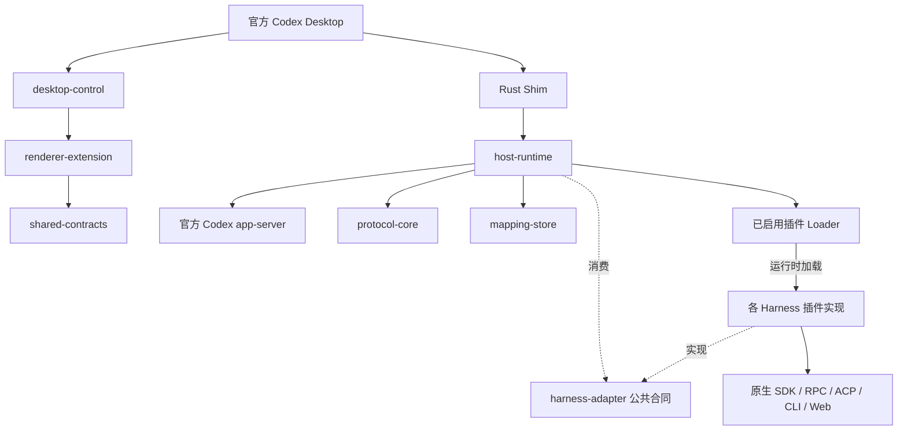

# Harness 插件架构

本文描述当前源码中的动态插件宿主与 Desktop 接入，不再作为迁移前的接口提案。使用方法、Manifest 示例和信任配置见[插件运行时](harness-plugin-runtime.md)；公共接口以源码和 schema 为准。发布版、原生 Harness 版本与实机验收需分别确认。

## 产品边界

codexhost 在官方 Codex Desktop 外壳中运行各自独立的 Harness Thread。官方 Codex 请求保留原生 app-server 路径；外部 Harness 通过自己的原生接口执行，再投影到 Desktop 的消息、工具、Diff、审批和提问界面。

统一的是 Host 调用边界、身份、状态和生命周期，不统一各 Harness 的 Agent Loop、历史文件或权限机制。ACP 是部分 Adapter 使用的通信协议，不是 Host 的领域接口，也不是所有 Harness 必须遵守的最低能力集合。术语见[领域术语表](领域术语表.md)。

## 包职责与依赖

图中的箭头表示调用或合同关系；Loader 在运行时加载插件，不表示 Host 编译依赖具体 Adapter。

| 所有者 | 职责 | 不应承担的职责 |
| --- | --- | --- |
| `crates/launcher`、`shim`、`updater`、`platform` | 启动、进程代理与身份、更新安装、平台集成 | Harness 协议与历史语义 |
| `shared-contracts` | 浏览器安全的 ID、schema、目录、配置和 route | Node、Electron 私有 API、原生 SDK 或其他 Workspace 依赖 |
| `harness-adapter` | Adapter / Session / Plugin 合同、公共输出、Usage 校验、conformance 入口 | 某个 Harness 的私有协议或文件格式 |
| `harness-discovery` | 可执行文件发现、调用参数辅助、spawn 时绑定的受管进程树关闭 | Session 权限、历史恢复和 Turn 状态 |
| `adapters/*` | 原生通信、能力确认、交互、历史、版本 profile 与资源清理 | 修改 Desktop 私有状态或重复 Host 映射事务 |
| `protocol-core` | 路由解码、事件身份和 Desktop 协议投影 | 解释原生 `_meta` 或调用 SDK |
| `mapping-store` | Thread / Native Ref、配置 carrier、执行意图与委派关系 | 取代 Harness 的权威历史正文 |
| `host-runtime` | 加载插件、编排操作、持久化提交、故障终结、恢复与委派 | 静态 import 具体 Adapter 或按名字模拟能力 |
| `desktop-control` / `renderer-extension` | Desktop 版本适配、目录与控件、Host 归属、展示和提交 | 在 Renderer 引入 Node、Electron 私有 API 或 Harness SDK |
| `harness-broker` | Aqua 承载与 Broker 通信 | 把 Claude Session 协议直接推广为通用 ACP |
| `update-manager` | 准备和校验更新、下载取消、状态和锁 | 安装或发布动作的 Native 实现 |
| `scripts/release` | 预装集合、Bundle、资源与发行元数据 | 在 Host 中维护另一份 Adapter 注册表 |

跨包使用公共 exports。`npm run lint` 中的 [check-boundaries](../tools/check-boundaries.mjs)同时检查 source import、生产依赖声明、TypeScript references 和绕过公共入口的 paths。

## 插件从加载到展示

1. Host 从实际 Runtime 相邻的预装目录及用户插件目录读取 Manifest 和 `enabled.json`；项目 cwd 不作为隐式插件搜索根。
2. Loader 验证路径、资源、重复 ID、API 版本与显式启用状态，再调用插件工厂。预装与用户插件使用同一加载合同。
3. 目标 Host 的 `codexhost/harness/plugins/list` 提供 ID、名称、图标和安装链接。Manifest 不存储动态 Model、权限和 Session 状态。
4. Renderer 使用目标 Host 的目录驱动 Picker、Sidebar 和按 Harness ID 保存的配置草稿；可用性、Model 和权限继续查询该 Host 的 inspection。
5. 新选择通过共享 `codexhost/plugin-v1@` route 编码。固定模型或空 Catalog 的可用 Harness 可以写入无 Model route；缺失或错误的外部 route 不转交官方 Codex。
6. 已有 Thread 使用持久化 Harness / Native Ref 恢复归属，不因为当前目录变化而换成别的 Harness。

旧 Host 明确缺少目录能力时，Renderer 使用兼容名单；历史专用 carrier 保留读取。它们是兼容边界，不是新插件的登记入口。因此当前公共层仍可能出现历史 Harness 名称，不能宣称全仓名字已清零。

主要实现：[Loader](../packages/host-runtime/src/harness-plugin-loader.ts)、[共享 route](../packages/shared-contracts/src/harness-route.ts)、[选择状态](../packages/renderer-extension/src/agent-selection-state.ts)、[绑定与目录](../packages/renderer-extension/src/renderer-binding-probe.ts)。

## Session 与操作生命周期

空闲原生资源通过公共 `resourceLifecycle.suspend` 合同释放。Host 的 `ManagedHarnessSession` 保留轻量 Thread，统一计时、保护并发、隔离输出代次并按需恢复；Adapter 原子判断原生任务与交互状态，不通过 Harness 名称分支决定是否强制关闭。具体支持范围及进程资源释放与后台任务静默的区别见[资源生命周期](harness-resource-lifecycle.md)。

### 进入 Host 的合同

`HarnessAdapter.inspect()` 报告当前可用性与能力；`open()` 支持 `create`、`resume`、`fork`、`rollbackLastTurn`，但实际支持范围由 Adapter 决定。成功 Session 经 [validateHarnessSession](../packages/harness-adapter/src/session-validation.ts)检查身份、Native Ref、能力、配置、Usage、方法和输出迭代器。

校验不提前消费 outputs，也不改变方法接收者。坏 Session 的清理由 Host helper 设置期限并记录失败，不让一个永不返回的 `close()` 阻塞整个打开请求。这是动态合同的可靠性检查，已启用插件仍是可信进程内代码，不是沙箱。

### 身份、占位与持久化

- Host 是 Session outputs 的唯一消费者；read / wait / list 使用已投影状态，不再次读取同一流。
- command 与 fork / revert / rollback / delete 使用同一个 per-Thread operation reservation，在首个异步阶段前取得，结束时释放；普通 Turn admission 也检查它。
- 配置操作先等待原生确认，再将完整 observed state 编码、持久化后响应成功。原生已应用而落盘失败是明确的部分失败，后续更新不得从旧 carrier 复活旧值。
- `executionPolicy` 是持久化 Thread 意图，沿支持的 create / resume / fork / rollback 传递；显式权限选择优先。旧记录缺字段时不推断权限提升。
- provisional Thread 与委派去重关系一起恢复。无法确认是否已经原生执行时返回 `outcomeUnknown`，不根据同一 requestId 自动重放。

核心入口：[AppServerHost](../packages/host-runtime/src/app-server-host.ts)、[MappingStore](../packages/mapping-store/src/mapping-store.ts)、[委派协调器](../packages/host-runtime/src/harness-delegation-coordinator.ts)。

### 终态与恢复

取消受理不等于 Turn 已停止。Adapter 必须根据原生事实产生终态、关闭交互并清理资源；Host 收口输出异常或意外结束，释放等待器并退休失败 Session。即使终态投影或持久化再次失败，等待器也必须结束。

Broker 的 `session.faulted` 同样是终态。认证失败先传递失败 Turn，再发送唯一 Session fault 并结束 outputs；Host 关闭旧 wrapper，后续同一 Thread 使用新的 `open(kind: "resume")` 恢复已确认的 Native Ref，不复活旧 wrapper。

### 历史与环境

原生历史归 Adapter 所有。派生操作必须确认源、边界、新身份与读回；失败时清理已创建的派生资源并保留源，不能只证明 Host sidecar 正确。Grok 使用原生 fork 保持源历史。Antigravity 按实际存在的 DB / brain / summary 验证；brain 存在而 DB 缺失、DB 复制或已有 summary 同步失败时拒绝派生。DB 与 brain 均不存在时仍保留 sidecar 兼容路径，该路径不能证明真实 CLI 历史恢复。这些格式不进入 Host。

每次 open 的 environment 必须到达执行工具的原生载体。OMP 首个 transport 使用当前 Session 的环境并探测订阅；DeepSeek 对带 Session environment 的打开使用独立 managed Web，同时共享 Native ID reservation，防止多个载体同时写同一原生 Session。独立环境不意味着可以复制登录态或越过原生权限。

## 能力与原生差异

`configuration`、`history`、`subagents` 等字段来自 inspection / Session；可选 `turnControl` 表达 `native` 或 `restart` steering 以及 `default` / `plan` 模式。缺少新元数据的旧插件可保留既有可选接口；存在声明时必须与接口实现一致。

原生插话与 cancel → wait → start 是不同操作。Model 可选列表为空，也不等于 Harness 不可执行。动态目录、原生可用性、能力支持和实际执行成功是不同状态。

| 具体差异 | 当前处理 |
| --- | --- |
| Pi 无等价权限档位 | 不制造 Permission Mode |
| Grok 权限在创建时确定 | 由原生打开路径处理，不伪造 live select |
| OMP 版本可能缺少 subagent 订阅 | 按当前 transport 探测结果声明能力 |
| OpenCode / Claude / DeepSeek 的派生 cwd 限制 | 按各 Adapter 的 history capability 检查 |
| Kiro 没有子代理过程正文读取 | 可观察状态，不声明 `readTranscript` |
| CodeBuddy / Cursor 无 Fork / rollback | 明确 unsupported，不由 Host 复制历史模拟 |
| DeepSeek 有明确协议版本 profile | 保留精确版本匹配及 V0 / V3 日志差异 |
| Antigravity 已有原生历史不完整或 schema 不兼容 | 拒绝派生并清理资源；无 DB / brain 的兼容路径独立判断 |

ACP 实现的可复用边界见[ACP 接入与复用](acp-layer-follow-up.md)。

## 发行、信任与 Native 平台

[发行清单](../scripts/release/harness-plugins.json)拥有当前十一个预装插件及各自运行依赖白名单。构建为每个插件生成独立 Bundle、资源、Manifest 和 `build-receipt.json`，记录 Bundle hash、实际依赖版本/许可、API 版本和 Node target。SDK 版本不是用户安装的原生 Harness 版本；未知 native version 为 `null`。

API v1 采用整数精确匹配；加性可选字段保持兼容，破坏性合同变化需要新的 API 版本。不引入插件市场、自动依赖安装、热替换或任意插件 UI。实际发行集合与 Host 运行时注册分开维护。

Rust 负责原生启动、进程身份和更新安装。TS 更新状态目录从 runtime descriptor 推导，与 Launcher 一致；下载总期限和无进度期限释放更新锁。Remote uninstall 在验证并停止 owned listener 后清理安装文件。macOS Broker 替换失败时恢复已验证旧 plist / generation，并要求新的 readiness descriptor；这些平台路径的实机验证独立于 TypeScript 测试。

## 验证与文档真源

[公共 conformance](adapter-conformance.md)通过真实 Adapter 和可控 native fixture 验证生命周期、身份、环境及清理。驱动独占 outputs，惰性激活通过同一 observer 等待终态；外部操作有期限，迟到资源仍需清理。

收据的 `passed`、`incomplete`、`failed` 区分完整、未覆盖和失败。核心路径测试通过，不会将未执行的 fork / rollback / permission / subagent 场景提升为通过。源码测试、可搬移 Bundle、合成 Desktop 与真实 CLI / Desktop / 平台运行各自提供证据，不能相互替代。

- 接入规则：[AGENTS.md](../AGENTS.md)与[Harness Skill](../.agents/skills/codexhost-add-harness/SKILL.md)。
- 当前合同：[shared-contracts](../packages/shared-contracts/src/index.ts)、[Adapter / Session](../packages/harness-adapter/src/text-session.ts)、[Plugin](../packages/harness-adapter/src/plugin.ts)。
- 使用和启用：[插件运行时](harness-plugin-runtime.md)。
- 既有验证：[2026-09-12 整改记录](full-project-review-2026-09-12/remediation/README.md)，按记录中的基线与文件指纹解读；后续文档更新不改写历史收据。

仍未完成的独立目标包括真实版本与平台的完整验收、远程/Broker Session Import、部分旧 Credits 路径统一，以及插件独立发布/升级体验。它们不意味着当前动态加载或通用 Renderer 接入尚未实现，也不构成已交付能力声明。
