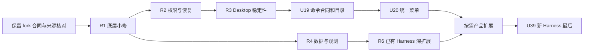

# codexhost fork：上游可借鉴改造清单

2026-09-26 · 当前 fork `af255feb` · 上游最新 main / v0.10.1 `997f62a0`

**建议保留 fork 的架构与定制能力，以小批次移植上游的协议修复、Desktop 兼容改进和原生能力扩展。不要整树同步，也不要把 0.7.0-local.11 当作“落后三个版本”。** 最值得先做的是官方辅助服务分流、大历史传输、SSH socket、权限继承、安装包一致性，以及连接和 Composer 路由解耦。新 Harness 接入排最后。

这份文档是后续开发队列，不是已实施结果。**按用户最新范围，排除其他 Harness 的 Session 历史导入，以及多账号、凭据导入和额度相关改造；额度刷新、展示及门控均不纳入。** 已管理会话的历史读取、fork/revise 和子任务冷恢复仍在范围内。共整理 **35 个候选工作包：17 个 P1、14 个 P2、4 个 P3**。有些候选依赖真实使用场景或产品决定；并不建议无条件全部实施。主要模块与分叉后的全部 release 主题均已筛选，关键建议追到两边源码和测试定义；不是全部变更逐行形式审计。

## 阅读与交付入口

- **本页**：结论、优先级、依赖、保留项和推荐迭代顺序。
- [AI 实施任务卡](/Users/luo/Documents/github/codex-host/docs/upstream-comparison-20260926/tasks.md)：35 个工作包的输入、步骤、验收、风险与回滚，可逐个派发。
- [版本、Release 与证据边界](/Users/luo/Documents/github/codex-host/docs/upstream-comparison-20260926/evidence.md)：完整 HEAD、共同祖先、远程核验、release 矩阵及许可证事实。
- 详细源码对照：[Native / 更新](/Users/luo/Documents/github/codex-host/docs/upstream-comparison-20260926/native-update.md)、[协议 / Runtime](/Users/luo/Documents/github/codex-host/docs/upstream-comparison-20260926/protocol-runtime.md)、[Desktop / Renderer](/Users/luo/Documents/github/codex-host/docs/upstream-comparison-20260926/desktop-renderer.md)、[既有 Harness](/Users/luo/Documents/github/codex-host/docs/upstream-comparison-20260926/existing-harnesses.md)。分域报告的初始局部排序服从本页统一排序。
- [独立复核](/Users/luo/Documents/github/codex-host/docs/upstream-comparison-20260926/review.md)、[研究工作记录](/Users/luo/Documents/github/codex-host/docs/upstream-comparison-20260926/workflow.md)。

## 1. 比较结论

双方共同基线为 `v0.7.0 / 7cc4db87`。fork 有 106 个独有提交，上游有 428 个独有提交，含 merge、文档、测试和已回退的尝试。上游本地仓库已通过远程 main/tag 核验，确为本次查询时的最新代码。最新发布说明为 [v0.10.1](https://github.com/BytePioneer-AI/codex-host/releases/tag/v0.10.1)；此前 [v0.9.0](https://github.com/BytePioneer-AI/codex-host/releases/tag/v0.9.0)、[v0.9.2](https://github.com/BytePioneer-AI/codex-host/releases/tag/v0.9.2)、[v0.10.0](https://github.com/BytePioneer-AI/codex-host/releases/tag/v0.10.0) 贡献了多数本轮高价值候选。

| 领域 | 上游值得借鉴之处 | fork 应保留的优势 / 约束 | 判断 |
| --- | --- | --- | --- |
| Native / 进程 / 安装 | 官方辅助进程分流、受限 sandbox 回落、恢复退避、npm 平台版本校验 | Rust anchor、owned-process API、记录身份回收、主动保留 escapee、现有发行载荷 | 局部移植；不换进程所有权模型 |
| 协议 / 数据 | 线性 JSONL、大历史 WebSocket、socket 链接、macOS stale lock、文件 diff 合并 | observer、delegation 去重与终态、Session 校验、持久化提交边界 | 优先处理小范围真实缺口 |
| Host / 架构 | 连接与 Composer 身份分离、工作区命令目录 | per-Session 生命周期、独立调用/释放时限、多账号定制 | 连接与命令目录有直接价值；账号模型保持现状 |
| Desktop / UI | 稳定注入、动态命令/技能、资源观测、收藏 | capability 驱动、Desktop 双 draft ID、既有重新订阅及 steering | 增量整合，避免重复实现 |
| 已有 Harness | 历史解析、取消语义、模型发现、子任务冷恢复、更多原生 fork | Grok interject/fork/suspend、OMP 订阅、Claude 配置与关闭修复 | 修复优先于拓展能力 |
| 工程交付 | CI 去重、Rust cache、针对平台分配检查 | anchor 测试初始化、package/tsconfig 边界检查、conformance | 借鉴调度，不照搬裁剪规则 |
| 产品扩展 | Pi 子任务、Cursor/CodeBuddy 派生 | 排除其他 Harness 原生会话导入 | 按实际缺失扩展 |
| 新 Harness | Hermes、Kimi、WorkBuddy、Qoder / Qoder CN | 现有 10 个 Adapter 的维护和真实验收成本 | 最后选择性立项 |

**许可证是搬运前的具体前提。** 上游 `e81df5a1` 已把项目改为 LGPL，fork 仍标 MIT。技术上可移植不代表可以原样沿用 MIT 声明；复制前核对具体代码版本的许可、归属和发布要求。详见证据页。本轮没有复制上游生产代码，也没有作法律结论。

## 2. 排序口径

- **P1**：现有链路的可靠性、权限、历史完整性、启动与路由；建议先进入迭代。表示技术优先级，不表示已在现场复现生产事故。
- **P2**：新能力、可观测性、性能与使用体验；在对应 P1 不变量稳定后实施。特定 Harness 高频使用时可以提升其适配项。
- **P3**：条件需求或产品取舍；默认暂缓。新增 Harness 永远排在已有能力治理之后。
- **S / M / L**：相对实施与验证规模。S 通常是局部函数及定向测试，M 涉及几条调用路径，L 跨公共合同/多层状态或原生持久化；不是工期承诺。
- **风险**指移植风险。即使上游已有测试，也要重新适配 fork 的合同；本轮未测性能、真实 Desktop、原生 Harness 或目标平台。

## 3. 优先清单

### P1：已有链路与底层修复

| ID | 改造 | 当前判断 / 价值 | 方式 · 规模 · 风险 | 依赖 |
| --- | --- | --- | --- | --- |
| U01 | 官方辅助 app-server 保留原生路由 | Shim 缺 memgen / auxiliary originator 例外，避免摘要等辅助服务被 Host 接管 | 小补丁 · S · 中 | 无 |
| U02 | 大历史响应与 JSONL 线性读取 | fork 每块重复拼接；远程 WebSocket 有 128 MiB 硬限 | 两个独立切片 · M · 中 | 无 |
| U03 | SSH 接受合法官方 socket 符号链接 | 当前只接受 socket 本体；保留链接/目标所有权与私有性校验 | 局部改造 · M · 中 | 无 |
| U04 | npm CLI / 平台载荷版本一致 | 防止旧平台二进制与新 CLI、anchor 混用 | 小补丁 · S · 低 | 无 |
| U05 | fork 继承有效权限模式 | 当前未显式继承；上游吞失败方式需加强 | 按 fork 合同重实现 · M · 高 | 无 |
| U06 | macOS Mapping Store 识别 PID 复用 | 活 PID 不能证明仍是锁 owner；只在确定 stale 时恢复 | 小范围改造 · M · 高 | 无 |
| U07 | 尊重 Harness 原有 Node PATH | 将 Host runtime 目录作为兜底，避免覆盖用户选择 | 小补丁 · S · 中 | 无 |
| U08 | 重复启动 / attachment 恢复退避 | Launcher 与 Controller 同时处理 busy、超时和恢复 | 双端改造 · M · 中 | 无 |
| U09 | Host 连接与 Composer 路由分离 | 稳定连接查询，保留工作区/side-chat/草稿身份 | 语义迁移 · L · 高 | 无；与 U10 协调 |
| U10 | Renderer 稳定性三项小修 | Agent 重排不重注入、跳过不可 attach CDP target、跟随新发送按钮 | 拆为三次小改 · M · 中 | UI 切片对齐 U09 |
| U12 | Subagent Thread 打开时保持 active | Host 已有 child 状态，register 却初始化 idle | 小补丁 · S · 中 | 无；保留 observer |
| U13 | 同一 Turn 文件改动合并 | 同路径重复编辑/删除，实时与历史投影一致 | 纯函数 + projector · M · 中 | 无 |
| U14 | DSH 重试历史接受合法小数延迟 | 正常 jitter journal 不应导致历史不可读 | 小补丁 · S · 低 | 无 |
| U15 | CodeBuddy `allow_always` 作用域 | 上游按 Session 映射；先核对固定原生版本语义 | 映射 + 合同确认 · S · 中 | 原生作用域证据 |
| U16 | OMP 容忍未跟踪调用的迟到事件 | 后台 update/end 不应无条件 fault 整个 Session | 边界修复 · M · 中 | 无 |
| U17 | Pi 取消结算时限与外层协调 | 2 秒窗口偏紧；不能只改 30 秒而忽略 Host 20 秒 steering | 有界协调 · M · 高 | 无；保留清理时限 |
| U18 | OpenCode managed server 的独立 cwd | server 启动目录与 Session 工作目录分别负责 | 局部改造 · M · 中 | 使用 managed server 时 |

### P2：架构完善与实用新功能

| ID | 改造 | 当前判断 / 价值 | 方式 · 规模 · 风险 | 依赖 |
| --- | --- | --- | --- | --- |
| U19 | 工作区 live command / skill catalog | 原生元数据经 Adapter 合同提供；有界检查、按 cwd 缓存 | 合同先行 · L · 高 | U09；保留 admission |
| U20 | Composer 统一 `#` 菜单 | 委派、命令、技能统一入口，保持原文与参数 | UI + mention 协议 · L · 高 | U19、U09 |
| U22 | 资源页显示已加载 Session 与释放状态 | 借观测 UI，接 fork 的 resourceLifecycle；不替换回收器 | 只读观测先行 · M · 中 | 无 |
| U23 | 目录加载与模型选择体验 | 活跃 Harness 优先、模型收藏、小屏控件；分别实施 | 三个增量切片 · M · 中 | 目录部分依赖 U09 |
| U24 | Claude 自定义模型目录 | 读取 modelPicker.options，兼容替换/追加与无效设置 | Adapter 局部改造 · M · 中 | 无 |
| U25 | OMP 已保存 child transcript 冷读取 | fork 已有订阅；只补持久化 child 恢复 | Adapter 局部改造 · M · 中 | U12、U16 推荐先做 |
| U26 | Pi 原生子任务工作流 | 实时和冷恢复统一 child identity，不混入 Host 委派 | 能力扩展 · L · 高 | U12；兼容 U17 |
| U27 | DSH V3 / V4 与新版协议适配 | 在 profile 层支持新 journal/权限/思考/工具输出 | 分协议迭代 · L · 高 | U14 |
| U28 | Cursor 原生历史 fork / revise | 当前声明不支持；先证派生正确再开放 capability | 原生能力扩展 · L · 高 | U05、owned-process 合同 |
| U29 | CodeBuddy 原生 fork / revise | 先证明原生历史与源不变，再开放能力 | 原生能力扩展 · L · 高 | U05、U15 |
| U30 | 更新请求超时继续观察结果 | 请求超时不等于后台失败，不重复 start | UI 状态机 · S · 中 | 现有 update status 合同 |
| U31 | CI 去重、Rust cache 与平台分工 | 降低重复检查，保留 anchor / boundary / conformance | 借理念调整 · M · 中 | 无 |
| U32 | 官方 section_position 排序透传 | 不用 external 时间排序伪造官方分组位置 | 小补丁 · S · 低 | 当前 Desktop 确认使用时 |
| U33 | macOS sandbox 重入 CLI 发现 | 仅在环境被清洗且顶层 sandbox 时恢复官方 CLI | 受限例外 · M · 高 | 隔离 fixture 复现；关联 U01 |

### P3：条件项与最后处理的扩展

| ID | 改造 | 何时值得做 | 规模 / 前提 |
| --- | --- | --- | --- |
| U34 | 显式 Desktop home/profile 覆盖 | 确需隔离用户配置、验证多 profile 或 LaunchServices/AppX 丢环境 | M；绝对目录白名单，远程边界 |
| U35 | Connections 安装/登录指引 | 提升已有 Harness 的接入可发现性 | S；指令来自官方、与实际兼容版本一致 |
| U37 | Windows Job 后代退出证明 | 找到真实等待树退出的调用点后 | M；上游 helper 未证明已有生产使用 |
| U39 | 新 Harness | 现有底层和所需能力完成后，按实际需求选择一个 | L / 每个；Hermes / Kimi / WorkBuddy / Qoder 最后 |

## 4. 推荐迭代顺序

不是一次合并 35 个工作包。建议如下，每轮完成对应验收后结束；不因为还有低优先级候选就自动扩张。

| 迭代 | 目标与候选 | 可并行边界 | 完成门槛 |
| --- | --- | --- | --- |
| R1 · 小范围高收益 | U01、U02、U03、U04、U07、U14 | native、protocol、DSH 三条只共享测试资源的轨道 | 聚焦用例通过；长历史分别验证 stdio / WebSocket；anchor 包与路由未退化 |
| R2 · 权限与恢复 | U05、U06、U08、U12、U15、U16、U17、U18 | fork/运行态同 owner 串行；独立 Adapter 可并行 | 权限失败无静默放宽、锁不误删、取消与迟到事件可确定收口 |
| R3 · Desktop 稳定性 | U09 → U10；U30 可独立 | Renderer 共享 binding/state 文件只给一个 owner | 路由/重连/草稿 fixture + 实际渲染；受影响 Desktop 合同探针通过 |
| R4 · 数据与观测 | U13、U22、U24、U25；按使用场景选 U32/U33 | projector、resource、Adapter 各自 owner | live/replay 一致；resource UI 不引入第二套释放逻辑 |
| R5 · 有协议支撑的新入口 | U19 → U20；U23；U31 独立 | 先冻结命令合同，再并行 Adapter / UI | 慢目录不拖住发送；命令参数/技能/委派无丢失；CI 不降覆盖 |
| R6 · 原生深扩展 | 按使用量选 U26/U27/U28/U29 | 每个 Harness 独立任务，原生环境测试串行 | 固定原生版本下 create/resume/fork/cancel/cleanup 收据与目标平台证据 |
| 以后 | U34、U35、U37 有需求再做；U39 最后 | 先明确产品决定与独立原生能力范围 | 不把设计、fixture 或安装成功当作产品验收 |

## 5. 必须保留与明确不搬运的内容

| 内容 | 决策与证据 |
| --- | --- |
| Rust anchor 与 owned-process API | 保留。fork 有 `crates/anchor`，统一进程入口、身份跟踪、回收、escapee 保留以及发行打包；上游没有等价物。参考 [process-anchor-remediation-plan.md](/Users/luo/Documents/github/codex-host/docs/process-anchor-remediation-plan.md)；历史验收记录不等于本轮重跑。 |
| ManagedHarnessSession / resourceLifecycle | 保留有界调用、独立 release 时限、busy/unknown/releaseFailed 与重试语义；上游 idle close 不能整搬。U22 仅观测现有真源。 |
| delegation / observer | 保留持久化身份、并发 admission、终态锁定、wait-many / change hub；新菜单和子任务能力接现有协议。 |
| package 与 tsconfig boundary | fork 除源码 import 外还校验 package dependency/project references，并限制 process-group signal owner；不能用上游较短检查器替换。 |
| Adapter conformance | fork 的真 Adapter 驱动、native identity、环境隔离、Turn grammar、cleanup 收据继续适用；不能删掉以减少测试成本。 |
| 插件加载/关闭 | fork 已迁入超时与取消修复，另有顺序关闭；不把上游同类提交再次记为缺口。 |
| macOS 进程观察优化 | fork 已先读身份、只为 owned process 读 executable path；不引入第二套上游观察器。 |
| 通用 Session import / Pi import | 两边已有同合同和实现；新增导入能力按用户要求排除。 |
| Usage 重新订阅 | fork 已有 generation 防旧事件及换 client 退订；只作为连接改造的回归约束，不立项优化额度或 Usage。 |
| OMP subagent subscription | fork 已发送订阅并区分 unsupported；不照搬上游宽泛忽略错误。U25 只补 cold transcript。 |
| 上游账号删除 | v0.8.2 是产品取舍；按用户要求保持现有多账号，不改 owner/pool，不删除账号数据或功能。 |
| Antigravity 失联清理 | fork 已有 per-child / unowned orphan 治理；只在慢 transcript + sibling fixture 证明缺口后追加任务，不直接缩短 TTL。 |
| 被撤回的 CodeBuddy trust preflight | 最新上游已撤回；不要从中间提交重新引入。 |
| Tailwind、品牌图标、GitHub Star 引导、skills 大批复制 | 不进入默认迭代。资源页可以沿用现有样式；有明确设计需求才引入 Shadow DOM 内的样式工具，不把 CSS 依赖升级当功能前置。 |

## 6. 交给 AI 的使用方式

每次给出一个任务 ID 或一个明确迭代；要求读取本页、对应任务卡和双树源码。第一步重验当前 HEAD/工作区与卡片前提，若目标已实现就关闭该卡而非重复搬运。实现权限不包含启动当前 Desktop、安装/更新、接触真实凭据、推送或发布；这些动作需根据后续用户请求确定。

对 U05/U06/U09/U17/U19/U20 及原生派生等高风险包，建议实现后交独立 reviewer；同一共享模块不得由多个代理同时改写。无论使用多少代理，最终以 fork 的实际 diff、最小测试和原生验收证据收口，不以子代理“已完成”代替验证。

**本次状态：** 五个子代理（请求为 GPT-6 Sol / high；后续核验发现默认角色固定 Sol / medium，不将请求值当作生效档位）分别完成四个领域研究与独立复核，主代理做版本核验、去重、补充工程/产品候选和任务整合。只新增本研究目录；未改生产代码、未提交或推送。产品测试与真实运行验收均未运行；文档校验及复核结果见工作记录。

## 7. 按用户要求退出队列的研究主题

U11（额度门控）、U21（Claude Session 导入）、U36（多账号 / 官方 runtime owner 改造）、U38（Pi 凭据导入）保留空号供研究追踪，**不生成实施卡，也不作为任何其他卡的隐含依赖**。其他 Usage、额度刷新与展示优化同样排除。分域证据中如出现这些主题，仅用于记录上游差异及排除原因，不构成开发建议。
